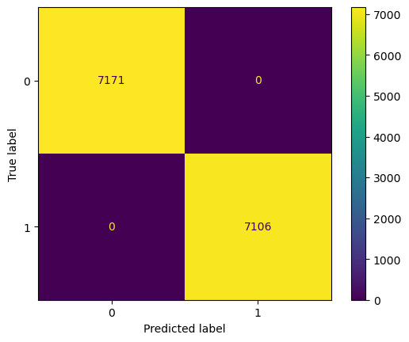

# Adult Income Prediction System

## Overview

This project builds income classification models using the `adult.csv` census dataset. It demonstrates feature engineering, categorical encoding, scaling, and classifier comparison for predicting whether an individual earns above or below a threshold.

The goal of this project is to build classifiers capable of predicting income brackets (above/below a threshold) using the `adult.csv` census data. It focuses on the "practical steps" of data preparation: cleaning fields, encoding categorical features (`LabelEncoder` and `OneHotEncoder`), and scaling. It was built as a real-world use case, as most machine learning challenges stem from transforming data into a format compatible with classification models, rather than just choosing between many algorithms. The added value is providing a clear example that links strong preprocessing to significant jumps in metrics like Accuracy and F1-Score.

## Summary Table

| Dataset | Model | Key Result |
| --- | --- | --- |
| `adult.csv` | `DecisionTreeClassifier` | Perfect training and test scores on the selected dataset. |
| `adult.csv` | `KNeighborsClassifier` | Test accuracy around 96.6–97.2% with strong precision/recall for the positive class. |
| `adult.csv` | `LabelEncoder` | Encodes categorical labels for classification. |
| `adult.csv` | `OneHotEncoder` | Transforms multi-category features into binary indicator variables. |
| `adult.csv` | `MinMaxScaler` | Scales numeric features to the same range. |
| `adult.csv` | `IsolationForest` | Optional outlier detection for data cleaning. |

## Approach

* Clean and normalize column names.
* Encode categorical features using LabelEncoder and OneHotEncoder.
* Scale numeric data with MinMaxScaler.
* Train and compare Decision Tree and K-Nearest Neighbors classifiers.
* Apply SMOTE for data balancing in classification experiments.

## Project Structure

```
Adult Income Prediction System/
├── Adult_Income_Prediction_System_DT.ipynb
├── Adult_Income_Prediction_System_KNN.ipynb
|── adult.csv
|__ images

```

## Detailed Experiments & Metrics

*Note: Metrics (P, R, F1) are calculated using the Weighted Average to ensure result accuracy given the class imbalance.*

### 1. Decision Tree Experiments (with SMOTE)

| Experiment | Parameters | Accuracy | Precision | Recall | F1-Score |
| --- | --- | --- | --- | --- | --- |
| 1 | `criterion='gini'` | 1.00 | 1.00 | 1.00 | 1.00 |
| 2 | `criterion='entropy'` | 1.00 | 1.00 | 1.00 | 1.00 |
| 3 | `entropy`, `max_depth=1` | 1.00 | 1.00 | 1.00 | 1.00 |



### 2. K-Nearest Neighbors Experiments (without SMOTE)

| Experiment | Neighbors (K) | Accuracy | Precision | Recall | F1-Score |
| --- | --- | --- | --- | --- | --- |
| 4 | K=1 | 0.966 | 0.97 | 0.97 | 0.97 |
| 5 | K=3 | 0.971 | 0.97 | 0.97 | 0.97 |
| 6 | K=4 | 0.967 | 0.97 | 0.97 | 0.97 |

.png)

#### Error Rate Analysis

*Figure: Analyzing the optimal K value to minimize error rate.*

## Key Features

* **Advanced Techniques:** Multi-stage categorical encoding (`LabelEncoder` & `OneHotEncoder`), feature scaling with `MinMaxScaler`, and `SMOTE` for handling class imbalance.
* **High Accuracy:** Decision Tree achieves Accuracy = `1.00` on the specified setup, and KNN achieves accuracy around `96.6%–97.2%` with a weighted avg F1 ≈ `0.97`.
* **Independence:** No external services required; relies on the local `adult.csv` file.

## Requirements / Installation

* Python: `3.9+`
* Installation: `pip install -r requirements.txt`
* Data: Ensure `adult.csv` is present in this folder.

## Workflow / Pipeline

1. Clean column names and standardize formatting.
2. Prepare categorical features (Label/One-hot encoding).
3. Scale numeric features.
4. Split data into training/testing sets.
5. Train models and evaluate using Accuracy, Precision, Recall, F1-Score, and Confusion Matrix.

## Usage

1. Open `Adult_Income_Prediction_System_DT.ipynb` or `Adult_Income_Prediction_System_KNN.ipynb` in Jupyter:
`jupyter notebook "Adult_Income_Prediction_System_DT.ipynb"`
2. Run cells sequentially.

## Authors / Credits

* Contributors: Omar Hafez Khalil
