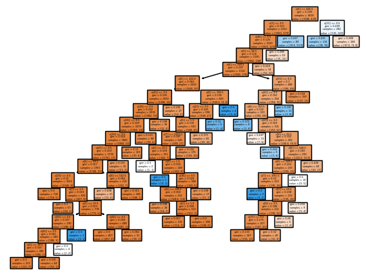

# Bank Campaign Success Predictor

## Overview


The project focuses on building artificial intelligence models capable of predicting customer responses to marketing campaigns, transforming historical customer data into informed decisions rather than random outreach. To achieve this, we implemented three interconnected technical stages: we used "Logistic Regression" and "Support Vector Machines" to estimate response probabilities and identify precise patterns in customer behavior, establishing a robust foundation for data analysis.

Because transparency in decision-making is vital, we applied the "Decision Tree" algorithm, which allows us to understand the marketing logic behind each classification such as identifying the age groups or job categories most likely to respond while fine-tuning the tree parameters to ensure the model’s accuracy when handling new customers, rather than simply memorizing past data.

In conclusion, we did not settle for "General Accuracy" alone; instead, we focused on Precision, Recall, and the Confusion Matrix to ensure a precise balance between identifying truly interested customers and minimizing the costs of contacting uninterested ones. This turns the project into a practical tool that enhances marketing campaign efficiency and increases bank returns.

## Summary Table

| Dataset | Model | Key Result |
| --- | --- | --- |
| `bank_marketing_dataset.csv` | `DecisionTreeClassifier` | Robust classification with hyperparameter tuning. |
| `bank_marketing_dataset.csv` | `LogisticRegression` | Effective baseline linear classifier. |
| `bank_marketing_dataset.csv` | `SVC` | Support Vector Classifier for pattern prediction. |
| `bank_marketing_dataset.csv` | `LabelEncoder` | Encodes binary and ordinal categorical fields. |
| `bank_marketing_dataset.csv` | `OneHotEncoder` | Encodes multi-category columns for model training. |

## Detailed Experiments

| Experiment | Model | Parameters | Train Acc | Test Acc |
| --- | --- | --- | --- | --- |
| 1 | `LogisticRegression` | `max_iter=100000` | 0.901 | 0.909 |
| 2 | `LogisticRegression` | `C=20, L1, liblinear` | 0.903 | 0.909 |
| 3 | `LogisticRegression` | `C=50, L1, liblinear` | 0.903 | 0.908 |
| 4 | `SVC` | Default | 0.881 | 0.897 |
| 5 | `SVC` | `C=1.5` | 0.881 | 0.896 |
| 6 | `DecisionTree` | Default | 1.000 | 0.869 |
| 7 | `DecisionTree` | `min_samples_split=100` | 0.911 | 0.901 |

## Performance Metrics (Decision Tree - Exp 7)

* Accuracy: **0.901** | Precision: **0.53** | Recall: **0.41** | F1-Score: **0.46**

## Decision Tree Visualization

*Figure: The visual logic of the Decision Tree model helping in customer segmentation.*

## Approach

* Encode binary and categorical variables using LabelEncoder and OneHotEncoder.
* Split data into training and test sets.
* Train Decision Tree, Logistic Regression, and SVC models.
* Evaluate classifier performance with accuracy, precision, recall, and F1 metrics.

## Project Structure

```
Bank Campaign Success Predictor/
├── bank_marketing_dataset.ipynb
├── bank_marketing_dataset.csv
└── plot_tree.png

```

## Model Results

| Model / Notebook | Key metrics (excerpt) |
| --- | --- |
| `LogisticRegression` | Test accuracy ≈ 90.9% |
| `DecisionTreeClassifier` | Best tuned test accuracy ≈ 90.1% |

## Key Features

* **Preprocessing:** Comprehensive use of `LabelEncoder` and `OneHotEncoder` to handle categorical data.
* **Model Variety:** Comparison between Linear (LogReg), Non-linear (Decision Tree), and Margin-based (SVC) classifiers.
* **Tuning:** Hyperparameter optimization (`C` value, `penalty`, `min_samples_split`) to balance training/test performance.

## Requirements / Installation

* Python: `3.9+`
* Installation: `pip install -r requirements.txt`

## Workflow / Pipeline

1. Load and clean the dataset.
2. Apply categorical encoding.
3. Split data (e.g., 85% train, 15% test).
4. Train various models and tune hyperparameters.
5. Evaluate using Accuracy, Precision, Recall, F1, and Confusion Matrix.

## Usage

1. Open `bank_marketing_dataset.ipynb` in Jupyter:
`jupyter notebook "bank_marketing_dataset.ipynb"`
2. Run cells sequentially.

## Authors / Credits

* Contributors: Omar Hafez Khalil
