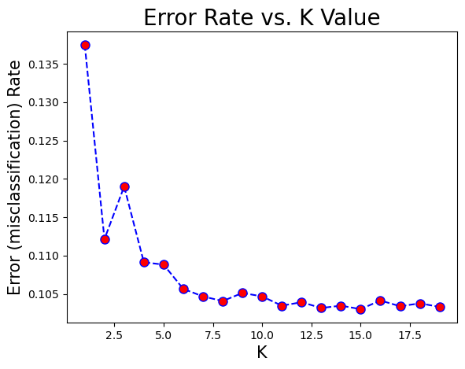
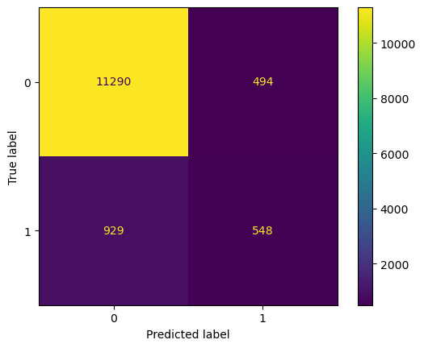
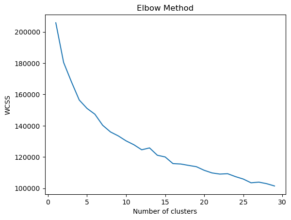

# Bank Term Deposit Prediction System

## Overview

This project predicts whether bank customers will subscribe to a term deposit using supervised classification and unsupervised clustering techniques.
The project includes preprocessing, feature encoding, classification experiments, clustering analysis, and performance evaluation using confusion matrices and silhouette scores.

---

# Summary Table

| Dataset         | Model / Technique        | Key Result                      |
| --------------- | ------------------------ | ------------------------------- |
| `bank-full.csv` | `DecisionTreeClassifier` | Accuracy ≈ `90.26%`             |
| `bank-full.csv` | `KNeighborsClassifier`   | Accuracy ≈ `89.65%`             |
| `bank-full.csv` | `RandomForestClassifier` | Accuracy ≈ `89.27%`             |
| `bank-full.csv` | `KMeans`                 | Silhouette Score ≈ `0.17`       |
| `bank-full.csv` | `DBSCAN`                 | Silhouette Score ≈ `0.4943`     |
| `bank-full.csv` | `LabelEncoder`           | Used for categorical encoding   |
| `bank-full.csv` | `OneHotEncoder`          | Applied to categorical features |
| `bank-full.csv` | `MinMaxScaler`           | Used for normalization          |
| `bank-full.csv` | `StandardScaler`         | Used for clustering and scaling |
| `bank-full.csv` | `IsolationForest`        | Optional outlier detection      |

---

# Approach

* Load and preprocess the `bank-full.csv` dataset using `sep=';'`.
* Handle categorical variables using `LabelEncoder` and `OneHotEncoder`.
* Normalize and standardize features using `MinMaxScaler` and `StandardScaler`.
* Train and evaluate multiple machine learning classification models.
* Apply clustering algorithms (`KMeans`, `DBSCAN`) for customer segmentation.
* Evaluate classification using:

  * Accuracy
  * Precision
  * Recall
  * F1-score
  * Confusion Matrix
* Evaluate clustering using:

  * Elbow Method
  * Silhouette Score

---

# Project Structure

```text
Bank Term Deposit Prediction System/
├──Bank_Term_Deposit_Prediction_System.ipynb
├── bank-full.csv
├── images
```

---

# Workflow / Pipeline

1. Load and preprocess dataset.
2. Encode categorical variables.
3. Scale and normalize features.
4. Split data into training and testing sets.
5. Train classification models:

   * Decision Tree
   * KNN
   * Random Forest
6. Evaluate models using confusion matrix and classification reports.
7. Apply clustering algorithms:

   * KMeans
   * DBSCAN
8. Analyze customer segmentation and clustering quality.

---

# Experiment 1 — Decision Tree Classifier

## Model

```python
DecisionTreeClassifier(
    criterion='entropy',
    max_depth=9,
    random_state=0
)
```

## Results

* Training Accuracy: `0.9175`
* Test Accuracy: `0.9025`
* Overall Accuracy:

```text
0.9026468592112209
```

## Confusion Matrix

```text
[[11486   298]
 [  993   484]]
```

## Classification Report

| Class | Precision | Recall | F1-score | Support |
| ----- | --------- | ------ | -------- | ------- |
| 0     | 0.92      | 0.97   | 0.95     | 11784   |
| 1     | 0.62      | 0.33   | 0.43     | 1477    |

* Accuracy: `0.90`
* Weighted Avg F1-score: `0.89`

## Confusion Matrix Visualization


.png)


## Analysis

We observe that the model predicts the first class very well, while the second class suffers from weak prediction performance.
This issue is mainly caused by **class imbalance**, where the second class contains significantly fewer samples than the first class.
As a result, the model becomes biased toward the majority class.
Balancing the dataset using techniques such as oversampling, undersampling, or SMOTE could improve performance.

---

# Experiment 2 — K-Nearest Neighbors (KNN)

## K Selection

The optimal value of K was selected using the error rate curve.

```text
Minimum error: 0.1030088228640374 at K = 14
```

## KNN Error Rate Visualization




## Model

```python
KNeighborsClassifier(n_neighbors=14)
```

## Results

* Accuracy:

```text
0.8965387225699419
```

## Confusion Matrix

```text
[[11658   126]
 [ 1246   231]]
```

## Classification Report

| Class | Precision | Recall | F1-score | Support |
| ----- | --------- | ------ | -------- | ------- |
| 0     | 0.90      | 0.99   | 0.94     | 11784   |
| 1     | 0.65      | 0.16   | 0.25     | 1477    |

* Accuracy: `0.90`
* Weighted Avg F1-score: `0.87`

## Confusion Matrix Visualization

.png)


## Analysis

The KNN model performs very well on the majority class but struggles to identify the minority class.
The recall for class `1` is very low (`0.16`), which indicates that many positive samples were incorrectly classified as negative.
This again reflects the effect of class imbalance in the dataset.

---

# Experiment 3 — Random Forest Classifier

## Model

```python
RandomForestClassifier()
```

## Results

* Accuracy:

```text
0.8926928587587664
```

## Confusion Matrix

```text
[[11290   494]
 [  929   548]]
```

## Classification Report

| Class | Precision | Recall | F1-score | Support |
| ----- | --------- | ------ | -------- | ------- |
| 0     | 0.92      | 0.96   | 0.94     | 11784   |
| 1     | 0.53      | 0.37   | 0.44     | 1477    |

* Accuracy: `0.89`
* Weighted Avg F1-score: `0.88`

## Confusion Matrix Visualization




## Analysis

The Random Forest model achieved strong performance on the majority class and slightly improved the minority class recall compared to KNN.
However, the model still suffers from class imbalance and shows bias toward the majority class.
Balancing techniques and hyperparameter tuning could improve detection of the minority class.

---

# Experiment 4 — KMeans Clustering

## Elbow Method

The Elbow Method was applied to determine the optimal number of clusters.




## Model

```python
KMeans(
    n_clusters=3,
    random_state=42
)
```

## Silhouette Score

```text
0.17
```

## Analysis

The silhouette score of `0.17` indicates weak cluster separation.
This means the clusters overlap significantly and the customer segmentation produced by KMeans is not highly distinct.
The dataset may require additional feature engineering or dimensionality reduction to improve clustering quality.

---

# Experiment 5 — DBSCAN Clustering

## Model

```python
DBSCAN(eps=1.1)
```

## Silhouette Score

```text
0.4943
```

## Analysis

DBSCAN achieved a significantly better silhouette score compared to KMeans.
This indicates that DBSCAN was more successful in identifying meaningful density-based clusters within the dataset.
The model handled irregular cluster structures better than KMeans.

---

# Overall Comparison

| Model         | Accuracy | Minority Recall | Weighted F1 | Notes                          |
| ------------- | -------- | --------------- | ----------- | ------------------------------ |
| Decision Tree | `90.26%` | `0.33`          | `0.89`      | Best overall accuracy          |
| KNN           | `89.65%` | `0.16`          | `0.87`      | Weak minority detection        |
| Random Forest | `89.27%` | `0.37`          | `0.88`      | Better minority recall         |
| KMeans        | —        | —               | —           | Weak clustering (`0.17`)       |
| DBSCAN        | —        | —               | —           | Stronger clustering (`0.4943`) |

---

# Key Observations

* The dataset suffers from **class imbalance**.
* All classification models achieved high overall accuracy due to dominance of the majority class.
* Minority class prediction remains challenging.
* Random Forest provided better balance between accuracy and minority recall.
* DBSCAN outperformed KMeans in clustering quality.

---

# Future Improvements

* Apply balancing techniques:

  * SMOTE
  * Random Oversampling
  * Undersampling
* Perform hyperparameter tuning.
* Use advanced ensemble models such as:

  * XGBoost
  * LightGBM
  * CatBoost
* Apply feature selection and dimensionality reduction.
* Experiment with deep learning models.

---

# Requirements / Installation

* Python `3.9+`

## Install Dependencies

```bash
pip install -r requirements.txt
```

---

# Usage

1. Open the notebook:

```bash
jupyter notebook "Bank_Term_Deposit_Prediction_System.ipynb"
```

2. Run all cells sequentially.

---

# Notes

This notebook combines supervised classification with unsupervised clustering to analyze customer behavior and predict term deposit subscriptions.

---

# Authors / Credits

* Contributors: Omar Hafez Khalil
* Dataset: Bank Marketing Dataset (`bank-full.csv`)
