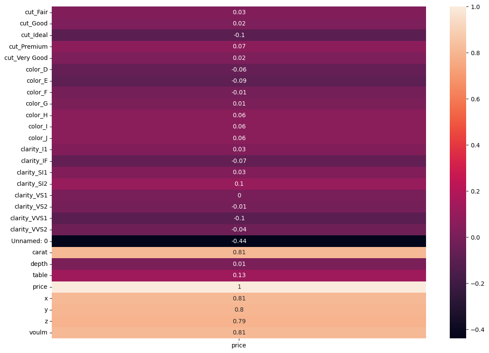

Here is the translation of your report into English, maintaining your professional structure:

---

# Diamond Price Predictor

## Overview

This project predicts diamond prices from the `diamonds.csv` dataset using regression models. It compares Decision Tree Regression and Linear Regression after performing data preprocessing and categorical encoding.

The goal of this project is to predict the price of a diamond based on its characteristics (cut, color, clarity) using regression, while handling categorical features correctly. It serves as an educational case study that combines two important topics: (1) how to transform categorical data into numerical inputs using `OneHotEncoder`, and (2) how to compare linear and non-linear models (Linear Regression vs. Decision Tree). The added value is providing a clear example of how the preprocessing stage directly impacts performance metrics such as RMSE and R².

## Summary Table

| Dataset | Model | Key Result |
| --- | --- | --- |
| `diamonds.csv` | `DecisionTreeRegressor`||
| `diamonds.csv` | `LinearRegression` |  |
| `diamonds.csv` | `OneHotEncoder` | Encoded categorical cut/color/clarity features. |
| `diamonds.csv` | `MinMaxScaler` | Scaled features for regression modeling. |
| `diamonds.csv` | `StandardScaler` | Standardized numeric features. |
| `diamonds.csv` | `IsolationForest` | Used for optional anomaly detection. |

---

## Additional Regression Experiments

### Heatmap Visualization


The heatmap was used to analyze feature correlations within the dataset and identify relationships between numerical variables and diamond prices.

### Experiment Results Table

| Experiment | Model | Training Results | Testing Results | Observation |
| --- | --- | --- | --- | --- |
| 1 | `DecisionTreeRegressor` (poisson) | R²=0.998, RMSE=0.0104 | R²=0.8168, RMSE=0.0981 | High training accuracy indicates overfitting. |
| 2 | `DecisionTreeRegressor` (friedman_mse) | R²=0.998, RMSE=0.0104 | R²=0.8037, RMSE=0.1016 | Strong overfitting. |
| 3 | `DecisionTreeRegressor` (squared_error) | R²=0.998, RMSE=0.0104 | R²=0.8097, RMSE=0.1000 | Overfitting detected. |
| 4 | `DecisionTreeRegressor` (max_depth=13) | R²=0.9025, RMSE=0.0728 | R²=0.8552, RMSE=0.0873 | Pre-pruning reduced overfitting. |
| 5 | `LinearRegression` | R²=0.9015, RMSE=879.06 | R²=0.9023, RMSE=863.06 | Stable and balanced generalization. |

### Overfitting Analysis

We observe that the difference in accuracy leads to overfitting. Therefore, we attempt to find the best values for the regression model to improve accuracy and ensure the training and testing performance scores are comparable.

### Finding the Optimal Parameters of the Decision Tree

**1- Pre-pruning Technique**

* **Criteria Used:** `poisson`, `squared_error`

**Pre-pruning Observation:**
We can see that the training-set score and test-set score became closer after applying pre-pruning. The training-set accuracy score is 0.9025, while the test-set accuracy is 0.8552. These two values are quite comparable, so there is no significant sign of overfitting.

---

## Approach

* Load and clean the diamond dataset.
* Encode categorical features such as cut, color, and clarity.
* Scale numeric features when needed.
* Train Decision Tree and Linear Regression models.

## Project Structure

```
Diamond Price Predictor/
├── Diamond_Price_Predictor_DT.ipynb
├── Diamond_Price_Predictor_LR.ipynb
├── Heatmap.png
└── diamonds.csv

```

## Notes

This project highlights regression modeling and categorical preprocessing for diamond price prediction.


## Key Features

* **Techniques:** Used `OneHotEncoder` for cut/color/clarity features, and `MinMaxScaler`/`StandardScaler` for feature normalization.
* **Performance:** Decision Tree achieved Test R² ≈ 0.90–0.85, while Linear Regression reached R² ≈ 0.901–0.902.
* **Integration:** Self-contained project using local `diamonds.csv` data.

## Requirements / Installation

* **Python:** 3.9+
* **Data:** Place `diamonds.csv` in the same directory or update the file path in the notebooks.

## Workflow / Pipeline

1. Load and clean `diamonds.csv`.
2. One-hot encode categorical features.
3. Scale numerical features if necessary.
4. Split data into training/testing sets.
5. Train Decision Tree and Linear Regression models.
6. Evaluate using R² and RMSE.
7. (Optional) Run `IsolationForest` for anomaly detection.

## Usage

1. Open the notebooks in Jupyter: `jupyter notebook "Diamond_Price_Predictor_DT.ipynb"`
2. Run cells sequentially.

## Authors / Credits

* **Contributors:** Omar Hafez Khalil