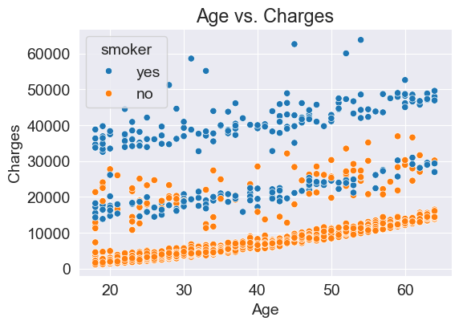
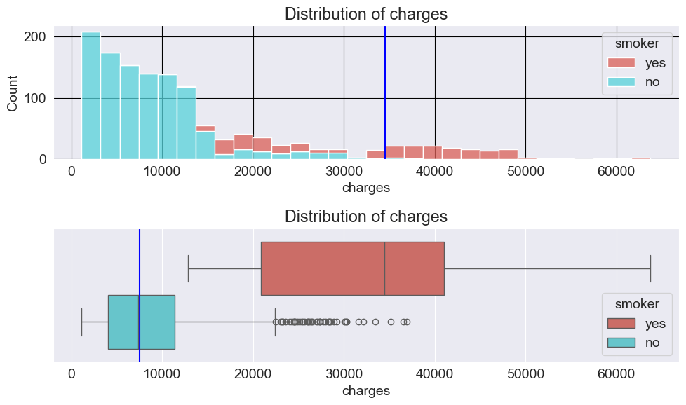
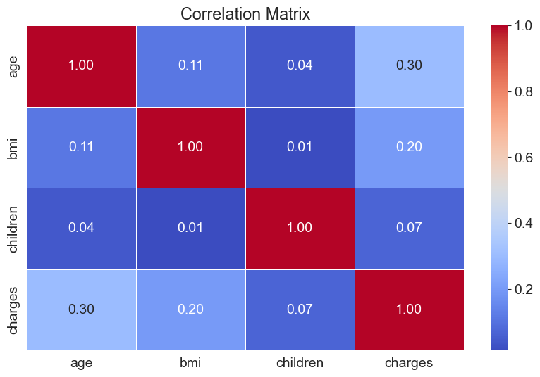
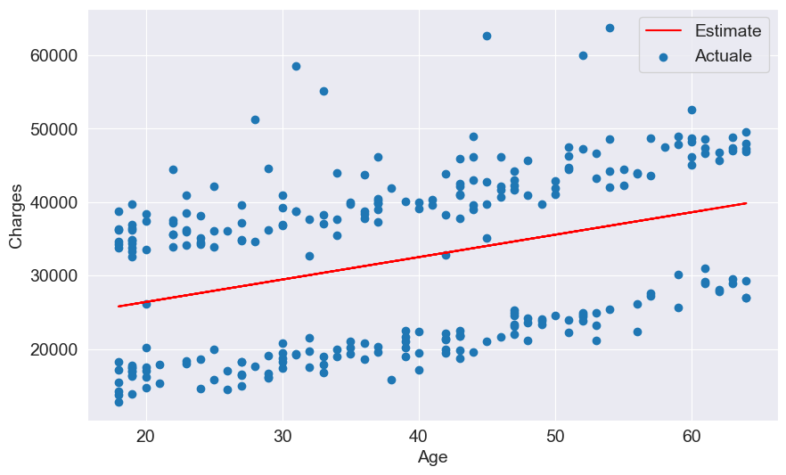
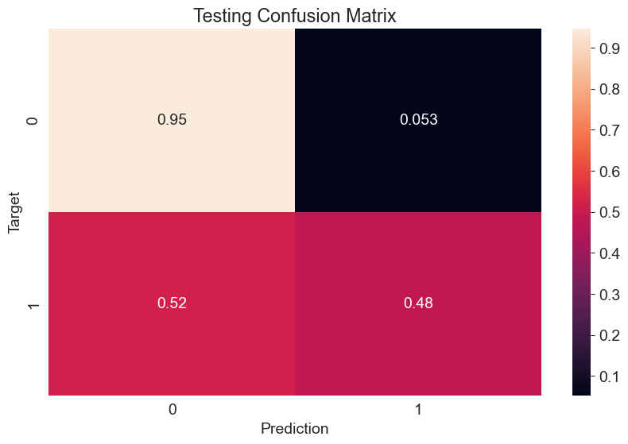

# Healthcare Insurance Cost Predictor

## Overview

This project predicts medical insurance charges from demographic and lifestyle features using **linear regression** with scikit-learn. It is built as a hands on (Machine Learning) training exercise that shows how prediction quality depends not only on the algorithm, but on **exploratory analysis**, **feature engineering**, **categorical encoding**, and **proper evaluation with RMSE**.

The main notebook (`Scikit Learning.ipynb`) walks through the full workflow on the classic **Medical Cost Personal Datasets** (`insurance.csv`). It also extends into a second case study—**rainfall prediction** with logistic regression—to practice a complete supervised-learning pipeline (train/validation/test splits, imputation, scaling, encoding, and model persistence).

## Summary Table

| Dataset | Task | Model / Technique | Key Result |
| --- | --- | --- | --- |
| `insurance.csv` | Regression | Manual linear fit (age only, non-smokers) | RMSE ≈ **8,462** (poor manual parameters) |
| `insurance.csv` | Regression | Manual linear fit (tuned parameters) | RMSE ≈ **4,992** |
| `insurance.csv` | Regression | `LinearRegression` (age only, non-smokers) | RMSE ≈ **4,663** |
| `insurance.csv` | Regression | `LinearRegression` (age only, smokers) | RMSE ≈ **10,711** |
| `insurance.csv` | Regression | `LinearRegression` (age, BMI, children — non-smokers) | RMSE ≈ **4,608** |
| `insurance.csv` | Regression | `LinearRegression` (all features + one-hot region) | RMSE ≈ **6,042** (best full model) |
| `weatherAUS.csv` | Classification | `LogisticRegression` + preprocessing pipeline | Accuracy ≈ **84–85%** on rain prediction |

## Dataset: Medical Insurance Costs

**Source:** [Medical Cost Personal Datasets](https://www.kaggle.com/datasets/mirichoi0218/insurance) (included locally as `insurance.csv`)

| Column | Type | Description |
| --- | --- | --- |
| `age` | Numeric | Age of the primary beneficiary (18–64) |
| `sex` | Categorical | `male` or `female` |
| `bmi` | Numeric | Body mass index |
| `children` | Numeric | Number of dependents covered |
| `smoker` | Categorical | Whether the person smokes (`yes` / `no`) |
| `region` | Categorical | US region (`northeast`, `northwest`, `southeast`, `southwest`) |
| `charges` | Numeric (target) | Individual medical costs billed by health insurance |

**Dataset size:** 1,338 records, 7 columns, no missing values.

**Key observations from EDA:**
- **Smoking status** is the strongest driver of cost; smokers pay dramatically higher charges.
- **Age** shows a clear positive relationship with charges, especially within smoker/non-smoker groups.
- **BMI** and **children** have weaker linear relationships with charges when smoker status is ignored.
- Charge distributions are **right-skewed**, with high-cost outliers among smokers.
- **Sex** and **region** have limited impact compared with smoking behavior.

## Exploratory Data Analysis



*Age vs. charges reveals three upward-sloping clusters—smokers consistently incur higher costs at every age.*



*Charge distributions are heavily right-skewed; smokers dominate the high-cost tail.*



*Numeric correlations confirm that age and BMI have modest linear relationships with charges.*

## Approach

### Part 1 — Linear Regression (Insurance Costs)

1. **Load and inspect** `insurance.csv` (schema, missing values, summary statistics).
2. **Explore visually** with histograms, box plots, scatter plots, violin plots, and ANOVA tests.
3. **Build intuition manually** by fitting lines of the form `charges = w × age + b` and tuning `(w, b)` by hand.
4. **Define RMSE** as the evaluation metric to compare parameter choices objectively.
5. **Train scikit-learn models:**
   - `LinearRegression` for closed-form least squares
   - `SGDRegressor` as an introduction to gradient-based optimization
6. **Segment the data** into smoker and non-smoker groups to show why a single global line fails.
7. **Add features progressively:** age → age + BMI + children → binary smoker encoding → sex encoding → one-hot region encoding.
8. **Apply `StandardScaler`** to numeric columns and compare coefficient interpretability before and after scaling.
9. **Make predictions** for new customer profiles using the trained model.

### Part 2 — Logistic Regression (Rain Prediction)

The notebook continues with the [Weather Dataset (Rattle Package)](https://www.kaggle.com/datasets/jsphyg/weather-dataset-rattle-package) to practice classification:

1. Download data with `opendatasets` (Kaggle credentials required).
2. Split into **train / validation / test** sets (time-based split by year: before 2015 / 2015 / after 2015).
3. **Impute** missing numeric values with `SimpleImputer` (mean strategy).
4. **Scale** numeric features with `MinMaxScaler`.
5. **Encode** categorical variables with `OneHotEncoder`.
6. Train **`LogisticRegression`** to predict `RainTomorrow`.
7. Evaluate with **accuracy** and **normalized confusion matrices**.
8. **Persist** the full preprocessing + model pipeline with `joblib`.



*After fitting `LinearRegression` on smokers using age alone, the learned line captures the upward trend but misses substantial variance.*



*Logistic regression achieves ~84% accuracy on rain prediction; the confusion matrix highlights class imbalance effects.*

## Model Results (Insurance Regression)

Progressive feature engineering dramatically improves predictions when smoker status is included:

| Experiment | Features | RMSE |
| --- | --- | --- |
| Manual fit (bad params) | Age only, non-smokers | 8,461.95 |
| Manual fit (better params) | Age only, non-smokers | 4,991.99 |
| Sklearn `LinearRegression` | Age only, non-smokers | 4,662.51 |
| Sklearn `LinearRegression` | Age only, smokers | 10,711.00 |
| Sklearn `LinearRegression` | Age + BMI + children, non-smokers | 4,608.47 |
| Sklearn `LinearRegression` | Age + BMI + children, smokers | 5,718.20 |
| Sklearn `LinearRegression` | Age + BMI + children (all rows) | 11,355.32 |
| Sklearn `LinearRegression` | + smoker binary encoding | 6,056.44 |
| Sklearn `LinearRegression` | + sex encoding | 6,056.10 |
| Sklearn `LinearRegression` | + one-hot region (full model) | **6,041.68** |
| Sklearn `LinearRegression` | Full model + `StandardScaler` | 6,041.68 |

**Takeaways:**
- Adding **smoker status** reduces RMSE from ~11,355 to ~6,056—a major improvement driven by the largest effect in the data.
- **Sex** and **region** contribute marginally once smoking is encoded.
- **Feature scaling** does not change RMSE for linear regression on the full dataset (predictions are identical), but it makes coefficients easier to compare for interpretation.
- The **smoker coefficient** (~23,849) dominates all other weights, confirming smoking as the primary cost driver.

## Techniques Used

| Category | Tools |
| --- | --- |
| Data manipulation | `pandas`, `numpy` |
| Visualization | `matplotlib`, `seaborn`, `plotly` |
| Regression | `LinearRegression`, `SGDRegressor` |
| Classification | `LogisticRegression` |
| Preprocessing | `OneHotEncoder`, `StandardScaler`, `MinMaxScaler`, `SimpleImputer` |
| Evaluation | RMSE (custom), `accuracy_score`, `confusion_matrix` |
| Model persistence | `joblib` |
| External data | `opendatasets` (Kaggle download) |
| Statistics | ANOVA (`scipy.stats.f_oneway`) |

## Project Structure

```text
Healthcare Insurance Cost Predictor/
├── Scikit Learning.ipynb    # Main notebook (regression + classification)
├── insurance.csv            # Medical insurance dataset (1,338 rows)
├── requirements.txt         # Python dependencies
├── images/                  # EDA and model result plots for documentation
│   ├── eda_age_vs_charges.png
│   ├── eda_charges_by_smoker.png
│   ├── correlation_heatmap.png
│   ├── linear_regression_smokers.png
│   └── confusion_matrix_test.png
└── README.md
```

> **Note:** Running the weather-prediction section will download `weatherAUS.csv` from Kaggle and may create `aussie_rain.joblib` in the project folder.

## Requirements / Installation

- **Python:** 3.9+
- **Install dependencies** (from the repository root):

```bash
pip install -r requirements.txt
```

Or install from this project folder (includes shared repo dependencies):

```bash
pip install -r "Healthcare Insurance Cost Predictor/requirements.txt"
pip install scipy plotly
```

**Additional packages used in the notebook:** `scipy`, `plotly`

**Data requirements:**
- `insurance.csv` is included in this folder.
- The weather dataset is downloaded automatically via `opendatasets` when you run Part 2 (Kaggle API credentials required).

## Usage

1. Open the notebook in Jupyter:

```bash
jupyter notebook "Scikit Learning.ipynb"
```

2. Run cells sequentially from top to bottom.
3. For Part 2 (weather data), ensure your Kaggle credentials are configured before running the download cells.

## Workflow / Pipeline

```text
insurance.csv
    │
    ├─► EDA (distributions, correlations, ANOVA)
    │
    ├─► Manual linear regression + RMSE
    │
    ├─► Sklearn LinearRegression (single & multi-feature)
    │
    ├─► Categorical encoding (binary + one-hot)
    │
    ├─► Feature scaling (StandardScaler)
    │
    └─► Predict charges for new customers

weatherAUS.csv (Kaggle)
    │
    ├─► Train / validation / test split (by year)
    ├─► Imputation → scaling → one-hot encoding
    ├─► LogisticRegression training
    ├─► Accuracy + confusion matrix evaluation
    └─► Save & reload pipeline with joblib
```

## Learning Objectives

This project demonstrates core ML concepts:

- How to **explore** a regression dataset before modeling
- Why **RMSE** is a natural loss function for continuous targets
- The difference between **manual parameter tuning** and **closed-form / iterative solvers**
- Why **segmenting** data (smokers vs. non-smokers) matters when patterns differ across groups
- How to encode **binary** and **multi-class categorical** variables for linear models
- When and why to apply **feature scaling** (interpretability vs. prediction)
- How to structure a **full ML pipeline** for classification with proper data splits and persistence

## Credits

- **Dataset:** [Medical Cost Personal Datasets](https://www.kaggle.com/datasets/mirichoi0218/insurance) by Mirae Choi
- **Weather dataset:** [Weather Dataset (Rattle Package)](https://www.kaggle.com/datasets/jsphyg/weather-dataset-rattle-package)

## Author

* **Developed by:** Omar Hafez Khalil
* **GitHub:** [OmarHKhalil](https://github.com/OmarHKhalil)
* **LinkedIn:** [Omar Khalil](https://www.linkedin.com/in/omar-khalil-55a674281)
