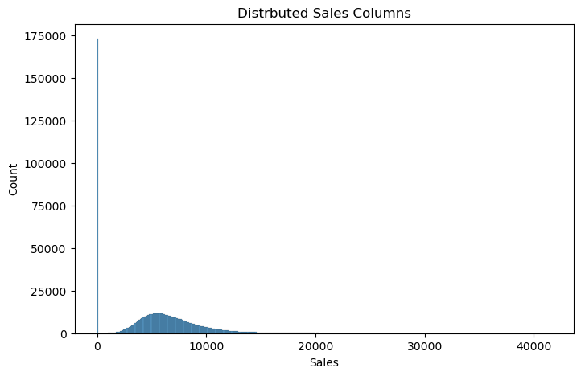
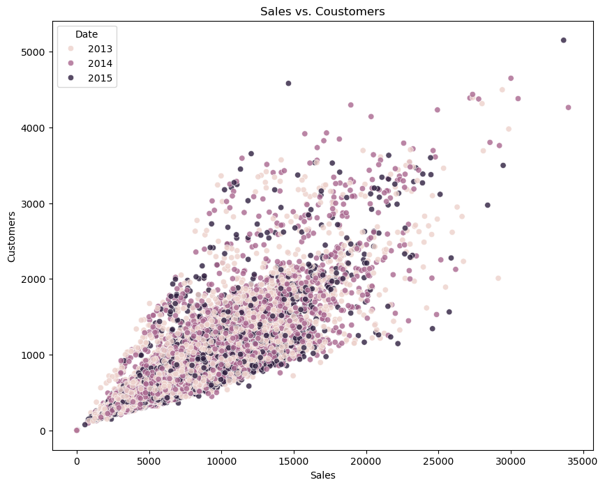
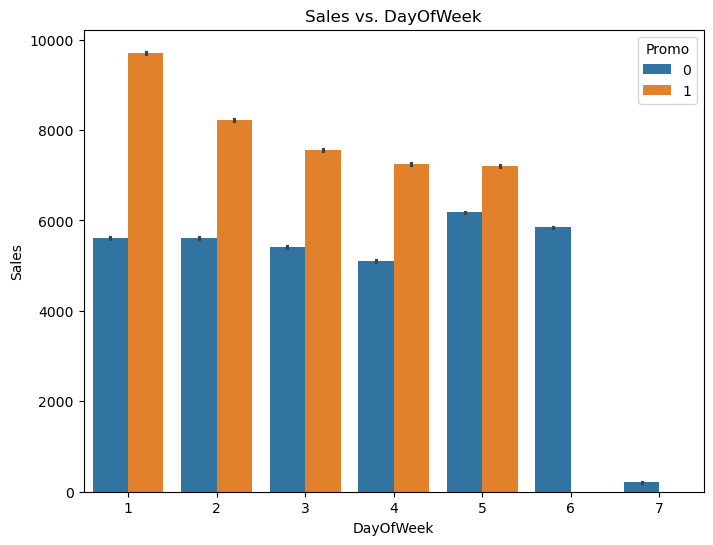
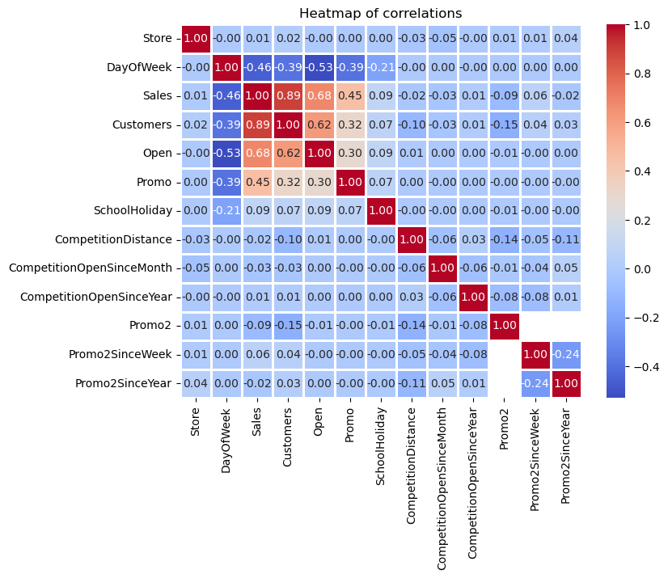
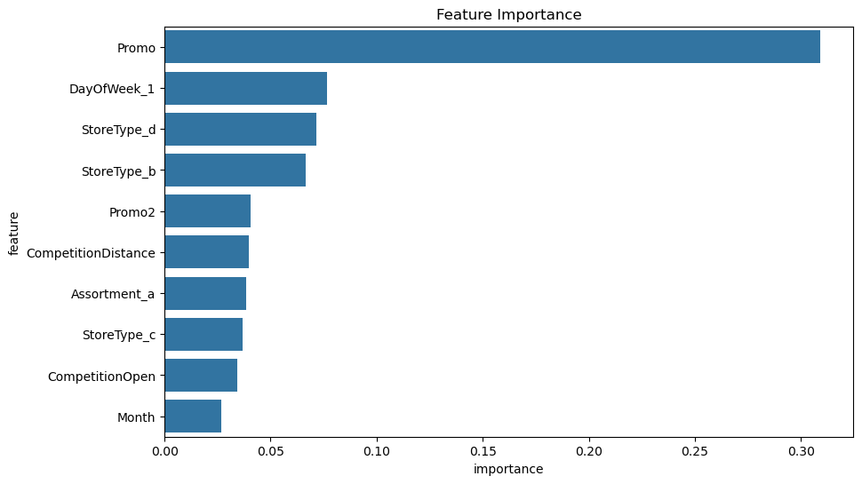
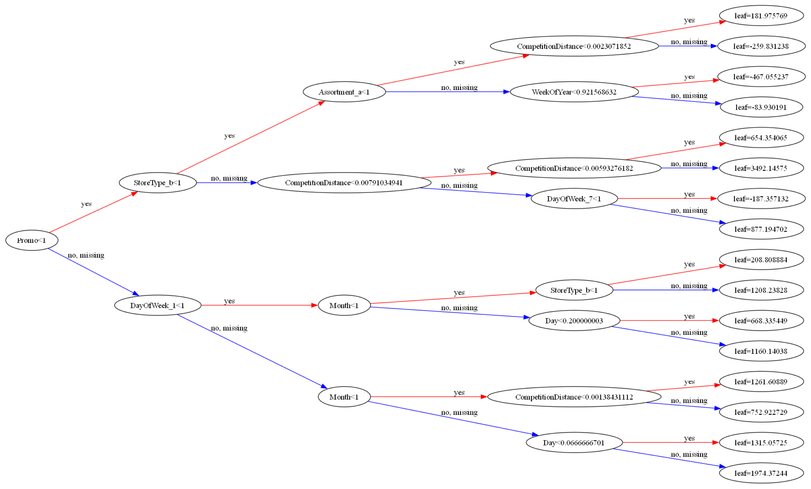

# Retail Sales Forecasting System

A machine learning training project that forecasts daily Rossmann store sales using gradient boosting (XGBoost). The workflow covers data download, exploratory analysis, feature engineering, model training, cross-validation, hyperparameter tuning, and interpretation — following the structure of the [Rossmann Store Sales](https://www.kaggle.com/c/rossmann-store-sales) Kaggle competition.

## Overview

Rossmann operates over 3,000 drug stores across seven European countries. Store managers historically predicted sales manually, which led to inconsistent accuracy. This project uses historical sales for **1,115 stores** to build a regression model that predicts the `Sales` column from store metadata, calendar features, promotions, and competition signals.

The goal is to turn time-series retail data into actionable forecasts for inventory and budget planning. The notebook demonstrates how to think about forecasting problems: engineer time-based features, encode categorical variables, train a strong regressor, and evaluate with RMSE.

## Key Results

| Stage | Configuration | RMSE |
| --- | --- | --- |
| Baseline XGBoost (20 trees, depth 4) | In-sample on full training set | ~2,357 |
| sklearn `GradientBoostingRegressor` | In-sample comparison | ~2,596 |
| XGBoost (1,000 trees, depth 4) | In-sample (overfitting) | ~942 |
| Top-10 features only | Subset of important columns | ~1,467 |
| 5-fold CV (`n_estimators=20`) | Mean fold RMSE | ~2,393 |
| 5-fold CV (`n_estimators=100`) | Mean fold RMSE | **~1,745** |
| `GridSearchCV` (3-fold) | `learning_rate=0.2`, `max_depth=9`, `n_estimators=300` | **~1,217** |
| Tuned model (manual search) | `lr=0.2`, `depth=10`, `n_estimators=1000`, `subsample=0.9`, `colsample_bytree=0.7` | Validation ~718–725 |

Lower RMSE is better. Cross-validation scores are more reliable than in-sample training error because they reflect generalization.

### Top Feature Importances (XGBoost)

| Feature | Importance |
| --- | --- |
| Promo | 0.309 |
| DayOfWeek_1 (Monday) | 0.076 |
| StoreType_d | 0.072 |
| StoreType_b | 0.066 |
| Promo2 | 0.040 |
| CompetitionDistance | 0.040 |
| Assortment_a | 0.038 |
| StoreType_c | 0.037 |
| CompetitionOpen | 0.034 |
| Month | 0.027 |

Promotions and day-of-week patterns dominate sales predictions, which aligns with retail intuition.

## Dataset

| File | Rows | Description |
| --- | --- | --- |
| `train.csv` | 1,017,209 | Historical sales with `Sales`, `Customers`, `Open`, `Promo`, holidays |
| `test.csv` | 41,088 | Future dates to predict (no `Sales` column) |
| `store.csv` | 1,115 | Store type, assortment, competition distance, promo metadata |

After merging store attributes and filtering to open days (`Open == 1`), the modeling set contains **844,392** rows.

### Data Exploration



Daily sales are right-skewed with most days showing moderate revenue and a long tail of high-sales days.



Sales and customer counts are strongly correlated; the relationship shifts across years, suggesting seasonality and growth trends.



Promotions lift sales on most weekdays; Sunday patterns differ because many stores are closed or run limited promos.



Numeric features such as `Promo`, `Customers`, and engineered competition/promo duration columns show measurable correlation with `Sales`.

## Approach

### 1. Data loading

- Download data from Kaggle via [`opendatasets`](https://github.com/JovianML/opendatasets) inside the notebook.
- Merge `train.csv` and `store.csv` on `Store` (same for the test set).

### 2. Exploratory data analysis

- Distribution plots for `Sales`, `DayOfWeek`, `Customers`, and `CompetitionDistance`.
- Bar and scatter plots for sales vs. promotions, holidays, assortment, store type, and calendar fields.
- Correlation heatmap on numeric columns.

### 3. Feature engineering

| Transformation | Purpose |
| --- | --- |
| `Year`, `Month`, `Day`, `WeekOfYear` from `Date` | Capture seasonality and calendar effects |
| Filter `Open == 1` | Remove zero-sales closed days |
| `CompetitionOpen` | Months since nearest competitor opened |
| `Promo2Open` | Months since extended promo (`Promo2`) started |
| `IsPromo2Month` | Whether current month is in the store's `PromoInterval` |
| `MinMaxScaler` on numeric columns | Scale features to [0, 1] |
| `OneHotEncoder` on categoricals | Encode `DayOfWeek`, `StateHoliday`, `StoreType`, `Assortment` |

**Input columns used for training:**

`Store`, `DayOfWeek`, `Promo`, `StateHoliday`, `SchoolHoliday`, `StoreType`, `Assortment`, `Promo2`, `Year`, `Month`, `Day`, `CompetitionDistance`, `WeekOfYear`, `CompetitionOpen`, `Promo2Open`, `IsPromo2Month`

### 4. Modeling

- Primary algorithm: **`XGBRegressor`** from [XGBoost](https://xgboost.readthedocs.io/).
- Baseline comparison: sklearn `GradientBoostingRegressor`.
- Evaluation metric: **RMSE** (`sklearn.metrics.root_mean_squared_error`).
- Validation strategy: **5-fold cross-validation** and a 10% hold-out split for hyperparameter search.

### 5. Hyperparameter tuning

Grid search explored:

- `max_depth`: 1–11
- `n_estimators`: 50–300
- `learning_rate`: 0.1–0.9

Best grid-search result: `learning_rate=0.2`, `max_depth=9`, `n_estimators=300` with CV RMSE ≈ **1,217**.

Additional manual tuning tested `n_estimators`, `max_depth`, `learning_rate`, `subsample`, `colsample_bytree`, `gamma`, and `min_child_weight`.

### 6. Model interpretation





Individual trees can be visualized with `plot_tree` (requires `graphviz`). XGBoost trees model residuals iteratively rather than raw sales values.

## Project Structure

```
Retail Sales Forecasting System/
├── XGBoost.ipynb          # Full notebook (EDA → training → tuning → predictions)
├── requirements.txt       # Python dependencies
├── README.md              # Project documentation
└── images/                # EDA and model plots exported from the notebook
```

## Requirements

- Python 3.9+
- Jupyter Notebook or JupyterLab

Install dependencies:

```bash
pip install -r requirements.txt
```

## Usage

1. Accept the [Kaggle competition rules](https://www.kaggle.com/c/rossmann-store-sales/rules).
2. Place Rossmann data in `rossmann-store-sales/` **or** let the notebook download it (Kaggle credentials required).
3. Open and run the notebook:

```bash
jupyter notebook XGBoost.ipynb
```

4. Execute cells from top to bottom. The notebook will:
   - Download/load data
   - Run EDA
   - Engineer features
   - Train and evaluate XGBoost
   - Tune hyperparameters
   - Generate test-set predictions

## Technologies

| Library | Role |
| --- | --- |
| `pandas` / `numpy` | Data manipulation |
| `matplotlib` / `seaborn` | Visualization |
| `scikit-learn` | Preprocessing, CV, metrics, `GridSearchCV` |
| `xgboost` | Gradient boosting regressor |
| `opendatasets` | Kaggle dataset download |

## Notes

- This is a **regression** task; confusion matrix and classification metrics do not apply.
- In-sample RMSE on the full training set can look very low when using many trees — use cross-validation for honest estimates.
- The notebook follows a tutorial-style workflow (Jovian/Kaggle learning path) and can be extended with competition notebooks for additional feature ideas.

## Author

- **Developed by:** Omar Hafez Khalil
- **GitHub:** [OmarHKhalil](https://github.com/OmarHKhalil)
- **LinkedIn:** [Omar Khalil](https://www.linkedin.com/in/omar-khalil-55a674281)
