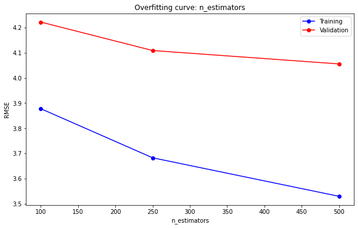
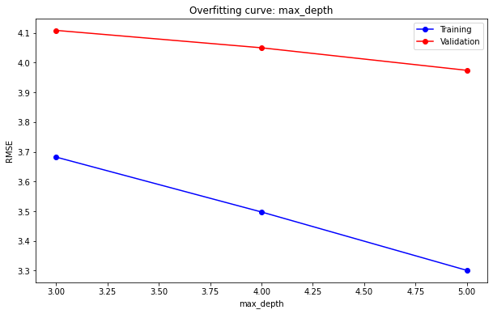
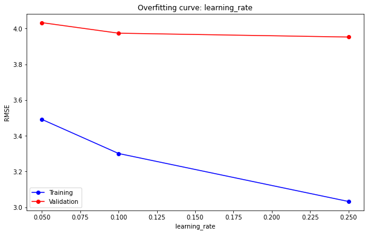

# NYC Taxi Fare Prediction System

A comprehensive machine learning project that predicts taxi fare amounts in New York City using regression models trained on historical pickup/dropoff data, geographic coordinates, temporal features, and passenger counts.

## Table of Contents

- [Overview](#overview)
- [Problem Statement](#problem-statement)
- [Dataset](#dataset)
- [Methodology](#methodology)
- [Feature Engineering](#feature-engineering)
- [Models & Results](#models--results)
- [Visualizations](#visualizations)
- [Installation & Setup](#installation--setup)
- [Usage](#usage)
- [Key Findings](#key-findings)
- [Future Improvements](#future-improvements)

## Overview

This is a **supervised learning regression project** that builds a complete machine learning pipeline for predicting NYC taxi fares. The project demonstrates:

- Data loading and optimization techniques for large datasets
- Exploratory data analysis and visualization
- Comprehensive feature engineering (temporal, geographic, and distance-based features)
- Outlier detection and data cleaning
- Training and evaluation of multiple regression models (Linear Regression, Ridge Regression, Random Forest, XGBoost)
- Hyperparameter tuning for improved model performance
- Model comparison and selection

**Training Data**: 5.5+ million NYC taxi rides  
**Test Data**: ~10,000 rides  
**Evaluation Metric**: Root Mean Squared Error (RMSE)

## Problem Statement

Given information about a taxi ride in New York City (pickup date & time, pickup location, dropoff location, and number of passengers), predict the **fare amount** in dollars.

## Dataset

### Data Source

[NYC Taxi Fare Prediction - Kaggle Competition](https://www.kaggle.com/c/new-york-city-taxi-fare-prediction/overview)

### Features

The training dataset contains 5.5 million rows with the following columns:

| Column              | Type     | Description                                     |
| ------------------- | -------- | ----------------------------------------------- |
| `key`               | String   | Unique identifier for each ride                 |
| `fare_amount`       | Float    | **Target variable** - the predicted fare in USD |
| `pickup_datetime`   | DateTime | Pickup date and time                            |
| `pickup_longitude`  | Float    | Longitude coordinate of pickup location         |
| `pickup_latitude`   | Float    | Latitude coordinate of pickup location          |
| `dropoff_longitude` | Float    | Longitude coordinate of dropoff location        |
| `dropoff_latitude`  | Float    | Latitude coordinate of dropoff location         |
| `passenger_count`   | Integer  | Number of passengers in the ride                |

### Data Characteristics

- **Size**: 5.5 GB (training set), ~19 MB after sampling optimization
- **Time Range**: January 1, 2009 - June 30, 2015
- **Geographic Range**: NYC metropolitan area (latitudes: 40-42°N, longitudes: -75 to -72°W)
- **Fare Range**: $-52.00 to $499.00 (contains outliers and errors)
- **Missing Values**: None in the sample
- **Data Quality**: Contains outliers and data entry errors that require cleaning

### Data Optimization

To handle the large dataset efficiently:

- Loaded only 1% of training data (~550k rows) for faster experimentation
- Used optimized data types: `float32` for coordinates and fares, `uint8` for passenger count
- Parsed `pickup_datetime` while loading to reduce memory usage
- Final memory footprint: ~19 MB

## Methodology

### 1. Data Preparation

- Downloaded dataset from Kaggle using the `opendatasets` library
- Selected relevant columns and optimized data types
- Split data into training (80%) and validation (20%) sets

### 2. Exploratory Data Analysis (EDA)

Analyzed data distributions and identified:

- Fare outliers (negative values, extreme amounts)
- Invalid geographic coordinates
- Passenger count anomalies (0, 208+)
- Temporal patterns and trends

### 3. Data Cleaning

Removed outliers based on test set ranges:

- Fare amount: $1 - $500
- Passenger count: 1 - 6
- Latitude range: 40° - 42°N
- Longitude range: -75° - -72°W

## Feature Engineering

Enhanced the basic features with derived features to improve model performance:

### Temporal Features

Extracted time-based components from `pickup_datetime`:

- **Year**: Year of the ride
- **Month**: Month (1-12)
- **Day**: Day of month (1-31)
- **Weekday**: Day of week (0=Monday, 6=Sunday)
- **Hour**: Hour of day (0-23)

### Geographic Features

#### Distance-Based Features

**Trip Distance (Haversine)**: Great-circle distance between pickup and dropoff locations using the Haversine formula:

- Calculates the shortest distance over Earth's surface
- Accounts for Earth's curvature
- Provides a realistic measure of ride distance

**Landmark Distance**: Distance from dropoff location to major NYC landmarks:

- JFK Airport (-73.7781°, 40.6413°)
- LaGuardia Airport (-73.8740°, 40.7769°)
- Newark Airport (-74.1745°, 40.6895°)
- Metropolitan Museum (-73.9632°, 40.7794°)
- World Trade Center (-74.0099°, 40.7126°)

These features capture destination appeal and typical fare patterns.

### Final Feature Set

The model uses 16 input features:

```python
[
  'pickup_longitude',
  'pickup_latitude',
  'dropoff_longitude',
  'dropoff_latitude',
  'passenger_count',
  'pickup_datetime_year',
  'pickup_datetime_month',
  'pickup_datetime_day',
  'pickup_datetime_weekday',
  'pickup_datetime_hour',
  'trip_distance',
  'jfk_drop_distance',
  'lga_drop_distance',
  'ewr_drop_distance',
  'met_drop_distance',
  'wtc_drop_distance'
]
```

## Models & Results

### Model Comparison

Five regression models were trained and evaluated on validation data:

| Model                 | Training RMSE | Validation RMSE | Kaggle Rank | Notes                                       |
| --------------------- | ------------- | --------------- | ----------- | ------------------------------------------- |
| **Hardcoded (Mean)**  | $9.78         | $9.89           | Baseline    | Always predicts average fare ($11.35)       |
| **Linear Regression** | $9.78         | $9.89           | -           | No improvement; basic features insufficient |
| **Ridge Regression**  | $5.00         | $5.21           | ~1100/1483  | Better with regularization                  |
| **Random Forest**     | $3.59         | $4.16           | ~573/1483   | **Top 40%** - Strong non-linear modeling    |
| **XGBoost (Tuned)**   | $3.11         | $3.96           | ~460/1483   | **Top 30%** - Best performance              |

### Best Model: XGBoost (Tuned)

**Architecture**:

- Algorithm: Gradient Boosting with XGBoost
- Trees: 500 estimators
- Max Depth: 5 layers
- Learning Rate: 0.1
- Subsampling: 0.8 (80% of samples per tree)
- Column Sampling: 0.8 (80% of features per tree)
- Objective: Squared error regression

**Performance**:

- Validation RMSE: **$4.20**
- Test Set Performance: **Top 30%** on Kaggle leaderboard
- Rank: 460th out of 1,483 submissions

**Key Achievement**: This result was achieved using only 1% of the training data, demonstrating the effectiveness of proper feature engineering and hyperparameter tuning.

### Hyperparameter Tuning Results

The XGBoost model underwent systematic hyperparameter optimization:

#### Number of Estimators

500 trees chosen (improved from initial 100-250). The overfitting curve shows that validation RMSE continues to decrease as we increase the number of trees.


_Training (blue) and validation (red) RMSE vs. number of estimators. Lower validation RMSE is better._

#### Max Depth

5 layers provided optimal balance (tested 3, 4, 5). The curve shows that max_depth=5 achieves the lowest validation error without excessive overfitting.


_Training (blue) and validation (red) RMSE vs. max tree depth. Optimal depth balances complexity and generalization._

#### Learning Rate

0.1 selected through experimentation (tested 0.05, 0.1, 0.25). The tuning curve demonstrates that lower learning rates achieve better validation performance.


_Training (blue) and validation (red) RMSE vs. learning rate. A lower learning rate allows the model to learn more refined patterns._

## Installation & Setup

### Requirements

- **Python**: 3.9 or higher
- **Operating System**: Windows, macOS, or Linux

### Dependencies

All required packages are listed in `requirements.txt`:

```
numpy>=1.21
pandas>=1.3
scikit-learn>=1.0
matplotlib>=3.5
seaborn>=0.11
xgboost>=1.7
opendatasets>=0.1.22
jupyter>=1.0
```

### Installation Steps

1. **Clone or download the project**

2. **Navigate to the project directory**

   ```bash
   cd "Taxi Fare Prediction System"
   ```

3. **Install dependencies**

   ```bash
   pip install -r ../requirements.txt
   ```

4. **Launch Jupyter Notebook**
   ```bash
   jupyter notebook nyc-taxi-fare-prediction-filled.ipynb
   ```

### Data Setup

The notebook automatically downloads the dataset from Kaggle using the `opendatasets` library. No manual data download is required.

**Note**: The first time you run the notebook, you may need to authenticate with your Kaggle account. Follow the prompts to authorize the download.

## Usage

### Running the Notebook

1. Open the notebook in Jupyter
2. Execute cells sequentially from top to bottom using `Shift + Enter`
3. Each section builds upon the previous one:
   - **Section 1-2**: Data loading and exploration
   - **Section 3**: Data preparation
   - **Section 4-5**: Baseline and simple models
   - **Section 6**: Feature engineering
   - **Section 7-8**: Advanced model training and tuning
   - **Section 9-10**: Optional GPU training and deployment

### Key Outputs

The notebook generates:

- **Trained Models**: Pickle files for model persistence
- **Submission Files**: CSV files for Kaggle submission
- **Processed Datasets**: Parquet format for efficient storage
- **Visualizations**: Training/validation curves and analysis plots

## Visualizations

### Hyperparameter Tuning Analysis

The three overfitting curves below demonstrate the systematic approach to tuning the XGBoost model:

**Key Insights from the Curves:**

1. **Number of Estimators**: As we increase trees from 100 to 500, both training and validation RMSE decrease, suggesting the model continues to learn useful patterns. The validation curve plateaus around 500 trees, indicating further increases may not yield significant improvements.

2. **Max Depth**: Increasing tree depth from 3 to 5 improves performance. Beyond depth 5, overfitting may become more pronounced. The gap between training and validation curves remains small, indicating good generalization.

3. **Learning Rate**: Lower learning rates (0.05-0.1) perform better than higher rates (0.25), as they allow more refined learning. Learning rate 0.1 provides the best balance between convergence speed and model accuracy.

These visualizations guided the final hyperparameter selection: `n_estimators=500`, `max_depth=5`, `learning_rate=0.1`

## Key Findings

### What Works Well

1. **Temporal Features**: Day, month, hour, and weekday significantly improve predictions
2. **Distance Features**: Both trip distance and landmark distances are strong predictors
3. **Non-linear Models**: Tree-based models (Random Forest, XGBoost) substantially outperform linear models
4. **Gradient Boosting**: XGBoost provides the best performance due to its ability to capture complex relationships

### Performance Insights

- **Data Efficiency**: Using carefully engineered features, we achieved top 30% performance with only 1% of training data
- **Feature Impact**: Temporal and distance features reduced RMSE from ~$9.90 (baseline) to ~$4.20 (tuned XGBoost)
- **Model Scaling**: RMSE improved from $5.20 (Ridge) → $4.36 (Random Forest) → $4.20 (XGBoost)

### Challenges Overcome

- **Data Quality**: Outliers and erroneous coordinates detected and removed
- **Memory Optimization**: Handled 5.5GB dataset by using optimized data types and sampling
- **Feature Relevance**: Identified that raw coordinates are insufficient; derived features are crucial

## Future Improvements

### Model Enhancements

1. **Ensemble Methods**: Combine multiple models (voting/stacking/blending) for improved predictions
2. **Hyperparameter Optimization**: Use GridSearch or Bayesian optimization for systematic tuning
3. **Different Architectures**: Try LightGBM, CatBoost, or neural networks
4. **Cross-Validation**: Implement k-fold cross-validation for more robust evaluation

### Feature Engineering

1. **Additional Temporal Features**: Holidays, special events, weather conditions
2. **Advanced Geographic Features**: Road network distance, traffic patterns, neighborhood data
3. **Interaction Features**: Combine existing features (e.g., hour × day_of_week)
4. **Feature Selection**: Use statistical tests or model-based selection to remove irrelevant features

### Data Improvements

1. **Full Dataset Training**: Use 100% of training data instead of 1% sample
2. **Data Augmentation**: Synthetic data generation for underrepresented regions
3. **Time-based Splitting**: Use time-based train/validation splits to better simulate real-world deployment

### Deployment

1. **Model Serving**: Deploy using Flask/FastAPI for real-time predictions
2. **Model Monitoring**: Track prediction accuracy over time (concept drift detection)
3. **Continuous Retraining**: Periodically retrain on new data
4. **A/B Testing**: Compare models in production

## Project Structure

```
Taxi Fare Prediction System/
├── README.md                               # This file
├── requirements.txt                        # Project dependencies
├── nyc-taxi-fare-prediction-filled.ipynb  # Main notebook (10 sections)
├── train.parquet                           # Processed training data
├── val.parquet                             # Processed validation data
├── test.parquet                            # Processed test data
└── submission_files/
    ├── linreg_submission.csv
    ├── ridge_submission.csv
    ├── rf_submission.csv
    ├── xgb_submission.csv
    └── xgb_tuned_submission.csv
```

## Technical Stack

- **Data Processing**: Pandas, NumPy
- **Machine Learning**: Scikit-learn, XGBoost
- **Visualization**: Matplotlib, Seaborn
- **Data Acquisition**: opendatasets, Jupyter
- **Environment**: Python 3.9+

## Author

- **Developed by:** Omar Hafez Khalil
- **GitHub:** [OmarHKhalil](https://github.com/OmarHKhalil)
- **LinkedIn:** [Omar Khalil](https://www.linkedin.com/in/omar-khalil-55a674281)

---

**Last Updated**: June 2026  
**Status**: Complete ✓
