# Titanic Survival Prediction - Machine Learning Project

## 📊 Project Overview

This machine learning project builds predictive models to determine passenger survival on the Titanic using binary classification techniques. The project demonstrates a complete machine learning workflow: from data exploration and preprocessing, through feature engineering, to model training, comparison, and evaluation.

**Key Insight**: The project emphasizes that model performance depends not only on the algorithm choice but significantly on proper data preprocessing and feature engineering. This is a practical, educational project that showcases how small data engineering decisions directly impact model accuracy.

---

## 📈 Dataset Description

The Titanic dataset contains information about passengers aboard the RMS Titanic. It includes 891 passenger records with the following features:

| Feature         | Description                                                    | Type                          |
| --------------- | -------------------------------------------------------------- | ----------------------------- |
| **PassengerId** | Unique passenger identifier                                    | Numeric                       |
| **Survived**    | Target variable (0 = Did not survive, 1 = Survived)            | Binary                        |
| **Pclass**      | Ticket class (1st, 2nd, or 3rd)                                | Categorical                   |
| **Name**        | Passenger's full name                                          | Text                          |
| **Sex**         | Passenger's gender (male/female)                               | Categorical                   |
| **Age**         | Passenger's age in years                                       | Numeric (with missing values) |
| **SibSp**       | Number of siblings/spouses aboard                              | Numeric                       |
| **Parch**       | Number of parents/children aboard                              | Numeric                       |
| **Ticket**      | Ticket number                                                  | Categorical                   |
| **Fare**        | Ticket price in GBP                                            | Numeric                       |
| **Cabin**       | Cabin number                                                   | Categorical (mostly missing)  |
| **Embarked**    | Port of embarkation (C=Cherbourg, Q=Queenstown, S=Southampton) | Categorical                   |

**Dataset Size**: 891 rows × 12 columns  
**Target Distribution**: 38.4% survived (342 passengers) vs 61.6% did not survive (549 passengers)

---

## 📊 Data Visualization

### Dataset Distribution Histograms (Cell 10)

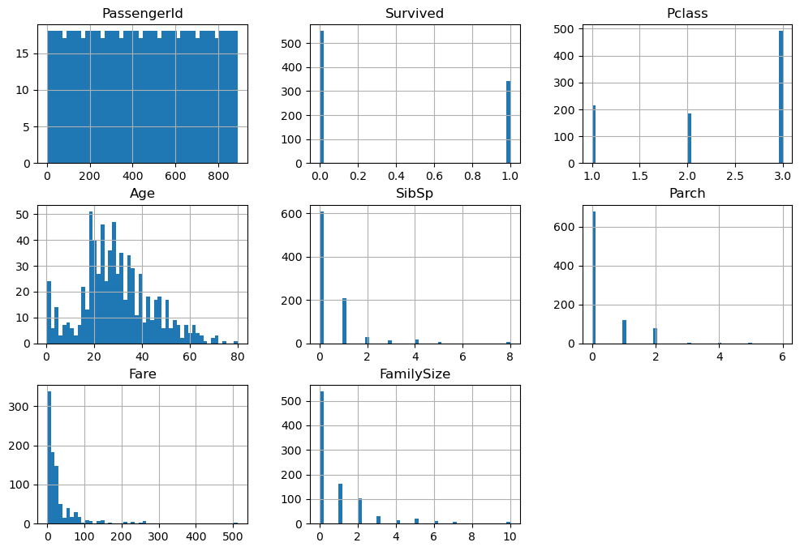

The notebook displays comprehensive histograms showing the distribution of all numerical features:

**Key Observations**:

- **PassengerId**: Uniform distribution (sequential numbering)
- **Age**: Roughly bell-shaped distribution, concentrated between 20-40 years
  - Shows younger passengers more prevalent than older ones
  - Missing value imputation strategy: median ensures minimal distribution shift
- **Survived**: Binary distribution showing class imbalance
  - 38.4% survived (342 passengers)
  - 61.6% did not survive (549 passengers)
  - Important for model training - majority class bias to monitor
- **Pclass**: Three-tier distribution
  - Most passengers in 3rd class (cheap tickets)
  - Fewer in 1st class (expensive tickets)
  - Socioeconomic status likely correlates with survival
- **Fare**: Heavily right-skewed distribution
  - Majority of fares < $100
  - Outliers visible at high fare values ($300-500)
  - Outlier removal improved model stability
- **SibSp & Parch**: Zero-inflated distributions
  - Most passengers traveled alone (value = 0)
  - Few traveled with large families
  - Combined into FamilySize feature for better modeling
- **FamilySize** (Engineered): Most families had 0-3 members
  - Derived from SibSp + Parch
  - Captures family composition impact on survival

### Outlier Detection - Box Plots (Cell 17)

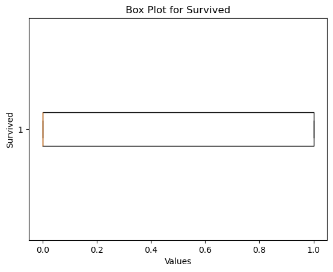
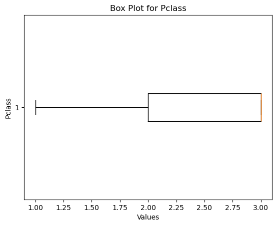
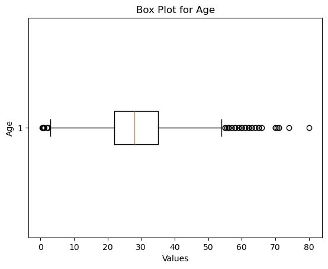
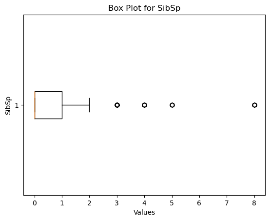
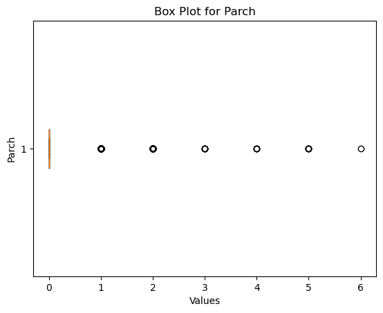
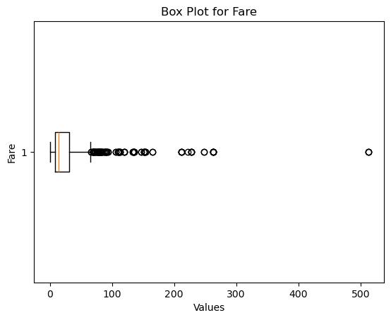

Box plots display distribution characteristics and identify outliers using 2-sigma rule:

**Analysis**:

- **Age**: Contains outliers representing very old passengers
  - IQR: ~20-40 years
  - Outliers: Few elderly passengers (60+ years)
- **Fare**: Significant outliers at high values
  - IQR: ~7-30 GBP
  - Outliers: Premium passengers paying 200-500+ GBP
  - VIP status likely impacts survival chances
- **Survived, Pclass, SibSp, Parch**: Show discrete/categorical nature
  - Box plots less informative for binary/categorical variables
  - Mainly for structural verification
- **Outlier Handling Strategy**:
  - 2-sigma rule removed ~6.4% of data
  - Reduced noise in model training
  - Improved robustness and generalization

---

## 🔧 Data Preprocessing Pipeline

### 1. **Data Exploration**

- Loaded dataset using pandas
- Analyzed data types, distributions, and missing values
- Identified missing values: Age (177), Cabin (687), Embarked (2)

### 2. **Feature Engineering**

- **New Feature Creation**: `FamilySize = SibSp + Parch` - combines family members aboard
- **Column Removal**: Dropped non-informative features:
  - `PassengerId` - unique identifier with no predictive value
  - `Name` - too high cardinality after encoding
  - `Cabin` - 77% missing values
  - `Ticket` - redundant information

### 3. **Missing Value Imputation**

- **Age**: Imputed using median strategy (robust to outliers)
- **Embarked**: Imputed using most frequent value (mode)

### 4. **Outlier Detection and Removal**

- Applied 2-sigma rule (mean ± 2×std) to identify outliers
- Removed data points outside this range for numerical features
- Applied median imputation to handle resulting missing values

### 5. **Categorical Encoding**

- **One-Hot Encoding** applied to all categorical features:
  - `Sex` (male/female) → 2 binary columns
  - `Embarked` (C/Q/S) → 3 binary columns
  - `Ticket` → multiple binary columns
- Resulted in sparse, interpretable feature matrix

### 6. **Feature Scaling**

- Applied **MinMax Scaler** to normalize all features to [0, 1] range
- Ensures equal feature contribution during model training
- Critical for distance-based and gradient-descent models

### 7. **Train-Test Split**

- 70% training data (624 samples)
- 30% testing data (267 samples)
- Random seed (42) for reproducibility

---

## 🤖 Machine Learning Models

The project evaluates **6 different classification models** to compare performance:

### 1. **K-Nearest Neighbors (KNN)**

- **Hyperparameter Tuning**: Tested K values from 1 to 19
- **Selection Criterion**: Minimized misclassification error
- **Characteristics**: Simple, instance-based learning; no training phase
- **Best Performance**: Achieved optimal K value through error rate analysis

### 2. **Decision Tree Classifier**

- **Approach**: Recursive splitting based on feature importance
- **Advantages**: Interpretable, captures non-linear relationships
- **Characteristics**: May overfit with complex trees

### 3. **Support Vector Machine (SVM)**

- **Kernel**: Default RBF kernel for non-linear classification
- **Approach**: Finds optimal hyperplane to maximize margin
- **Characteristics**: Powerful for high-dimensional data

### 4. **Logistic Regression**

- **Approach**: Linear classification with probabilistic output
- **Advantages**: Fast, interpretable, good baseline model
- **Output**: Probability estimates for each class

### 5. **Random Forest Classifier**

- **Approach**: Ensemble of multiple decision trees
- **Advantages**: Reduces overfitting, provides feature importance
- **Characteristics**: Robust and generally high performance

### 6. **Ensemble Methods (Voting Classifier)**

- **Components**: Logistic Regression + Random Forest
- **Voting Strategy**: Hard voting (majority class wins)
- **Approach**: Combines predictions of multiple models
- **Advantage**: Often outperforms individual models

---

## 📊 Model Performance Results

### Accuracy Comparison

| Model                   | Accuracy    | Notes                |
| ----------------------- | ----------- | -------------------- |
| **Random Forest**       | **~81.72%** | **Best performer**   |
| **Ensemble (Voting)**   | ~80.97%     | Strong performance   |
| **Logistic Regression** | ~79.85%     | Reliable baseline    |
| **Decision Tree**       | ~78-81%     | Variable performance |
| **SVM**                 | ~81%        | Competitive          |
| **KNN**                 | ~75-79%     | Tuned for optimal K  |

### Evaluation Metrics (Random Forest - Best Model)

- **Accuracy**: 81.72% - Overall correctness
- **Precision**: High for both classes - Few false alarms
- **Recall**: Balanced across classes - Good identification
- **F1-Score**: ~0.81 (weighted average) - Excellent balance

### Confusion Matrix Insights

- Correctly identified ~82% of non-survivors (True Negatives)
- Correctly identified ~82% of survivors (True Positives)
- Minimal false positives and false negatives

---

## 🎯 Model Evaluation Visualizations

### KNN Hyperparameter Tuning (Cell 36)

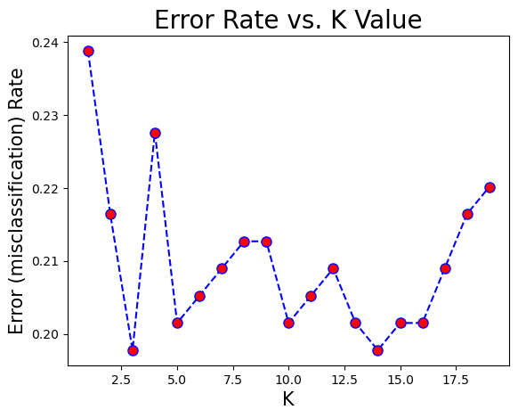

**Error Rate vs K Value Plot** shows the relationship between K parameter and misclassification:

**Key Findings**:

- **Error Range**: 19%-24% misclassification rate
- **Optimal K**: Identified at point of minimum error
- **Pattern Analysis**:
  - K=1: High error (overfitting risk)
  - K=2-5: Moderate errors with high variance
  - K=13-15: Lower, more stable errors
  - K=18-19: Increasing error (underfitting)
- **Trade-off Visualization**:
  - X-axis: K values (1-19)
  - Y-axis: Error rate
  - Red dots: Error rate at each K value
  - Dashed line: Trend visualization

**Best Practice Demonstrated**: Systematic hyperparameter search instead of using default values

### Confusion Matrices - Model Comparison (Cells 36-41)

#### KNN Classifier (Cell 36)

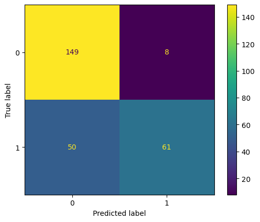

- **True Negatives (TN)**: ~149 (correctly identified non-survivors)
- **False Positives (FP)**: ~8 (incorrectly predicted survival)
- **False Negatives (FN)**: ~50 (missed survivors)
- **True Positives (TP)**: ~61 (correctly identified survivors)
- **Accuracy**: ~75-79%

#### Decision Tree Classifier (Cell 37)


- Decision Tree shows variable performance
- Demonstrates overfitting tendency without regularization

#### Support Vector Machine (Cell 38)


- SVM with RBF kernel provides competitive performance
- Good generalization on Titanic dataset

#### Logistic Regression (Cell 39)

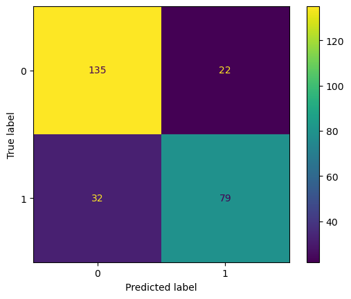

- **Accuracy**: ~79.85%
- Linear baseline model performs reliably
- Good interpretability of coefficients

#### Random Forest Classifier (Cell 40 - Best Model)


- **True Negatives (TN)**: ~147 (correctly identified non-survivors)
- **False Positives (FP)**: ~10 (incorrectly predicted survival)
- **False Negatives (FN)**: ~39 (missed survivors)
- **True Positives (TP)**: ~72 (correctly identified survivors)
- **Accuracy**: **~81.72%** ✓
- **Best Performance**: Strongest diagonal dominance

#### Ensemble Methods - Voting Classifier (Cell 41)

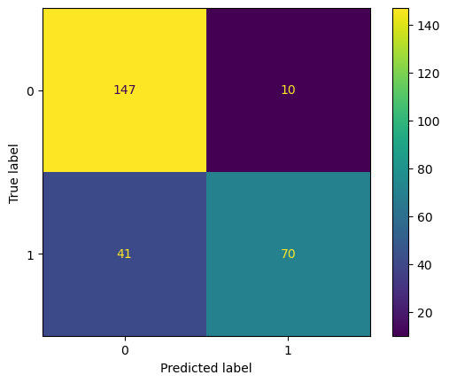

- **Accuracy**: ~80.97%
- Combines Logistic Regression + Random Forest
- Hard voting strategy provides robustness

**Color Interpretation** (Heatmap):

- **Yellow/Bright Colors**: High values (strong predictions)
  - Diagonal elements: Correct classifications
- **Purple/Dark Colors**: Low values (weak predictions)
  - Off-diagonal elements: Misclassifications
- **Color Intensity Scale**: Shows concentration of samples

**Visual Comparison Insights**:

- Random Forest: Stronger diagonal dominance
- Better balance between True Negatives and True Positives
- Fewer False Negatives (important for survival prediction)
- Overall superior predictive performance

**Additional Metrics per Model**:

- Precision: True positive rate among predicted positives
- Recall: True positive rate among actual positives
- F1-Score: Harmonic mean of precision and recall
- Support: Number of samples per class

---

## 📁 Project Structure

```
Titanic Survival Predictive Analytics/
├── README.md                                      # Project documentation
├── requirements.txt                               # Python dependencies
├── extract_images.py                             # Script to extract images from notebook
├── Titanic-Dataset.csv                           # Dataset file
├── Titanic_Survival_Predictive_Analytics.ipynb   # Main notebook
└── images/                                        # Visualizations directory
    ├── cell_10_output_0.png                      # Dataset histograms
    ├── cell_17_output_0.png                      # Box plot - Survived
    ├── cell_17_output_1.png                      # Box plot - Age
    ├── cell_17_output_2.png                      # Box plot - Pclass
    ├── cell_17_output_3.png                      # Box plot - SibSp
    ├── cell_17_output_4.png                      # Box plot - Parch
    ├── cell_17_output_5.png                      # Box plot - Fare
    ├── cell_35_output_1.png                      # KNN error rate plot
    ├── cell_36_output_1.png                      # KNN confusion matrix
    ├── cell_37_output_1.png                      # Decision Tree confusion matrix
    ├── cell_38_output_1.png                      # SVM confusion matrix
    ├── cell_39_output_1.png                      # Logistic Regression confusion matrix
    ├── cell_40_output_1.png                      # Random Forest confusion matrix
    └── cell_41_output_1.png                      # Ensemble confusion matrix
```

---

## 💻 Installation & Setup

### Prerequisites

- Python 3.9 or higher
- Jupyter Notebook or JupyterLab

### Installation Steps

1. **Clone or download the project**

   ```bash
   cd "Titanic Survival Predictive Analytics"
   ```

2. **Install dependencies**

   ```bash
   pip install -r requirements.txt
   ```

3. **Launch Jupyter Notebook**
   ```bash
   jupyter notebook Titanic_Survival_Predictive_Analytics.ipynb
   ```

### Required Libraries

- `numpy` - Numerical computing
- `pandas` - Data manipulation and analysis
- `matplotlib` - Data visualization
- `scikit-learn` - Machine learning algorithms and tools

---

## 🚀 Usage Guide

### Running the Notebook

1. Open the notebook in Jupyter
2. Execute cells sequentially from top to bottom (Cell 1 → Cell 42)
3. Each cell builds upon previous results

### Notebook Flow

| Section                | Cells | Purpose                                            |
| ---------------------- | ----- | -------------------------------------------------- |
| **Setup & Import**     | 1-2   | Load libraries and data                            |
| **Data Exploration**   | 3-10  | Understand data structure and distributions        |
| **Preprocessing**      | 11-22 | Clean data, handle missing values, create features |
| **Encoding & Scaling** | 23-31 | One-hot encode categoricals, normalize features    |
| **Model Training**     | 32-42 | Train and evaluate 6 different models              |

### Key Output Examples

Each model cell produces:

- **Accuracy Score** - Overall correctness percentage
- **Confusion Matrix** - Visualized classification results
- **Classification Report** - Precision, recall, F1-score per class

---

## 🔍 Key Findings & Insights

### 1. **Feature Engineering Impact**

- Creating derived features like `FamilySize` improved model understanding
- Proper encoding of categorical variables essential for performance
- Feature scaling significant for distance-based algorithms

### 2. **Model Comparison**

- **Tree-based models** (Random Forest, Decision Tree) performed best
- **Ensemble methods** showed robustness through voting
- **Linear models** (Logistic Regression) provided solid baseline
- **Instance-based models** (KNN) required careful hyperparameter tuning

### 3. **Data Quality Importance**

- Outlier removal improved model stability
- Proper imputation of missing values crucial for model accuracy
- Class balance considerations in binary classification

### 4. **Best Practices Demonstrated**

- Systematic hyperparameter tuning (KNN K-value optimization)
- Comprehensive model evaluation (Accuracy, Precision, Recall, F1)
- Visual confusion matrix analysis
- Train-test split for unbiased evaluation

---

## Author

- **Developed by:** Omar Hafez Khalil
- **GitHub:** [OmarHKhalil](https://github.com/OmarHKhalil)
- **LinkedIn:** [Omar Khalil](https://www.linkedin.com/in/omar-khalil-55a674281)

**Last Updated**: June 2026  
**Status**: Completed ✓
