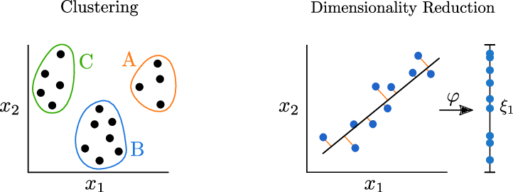
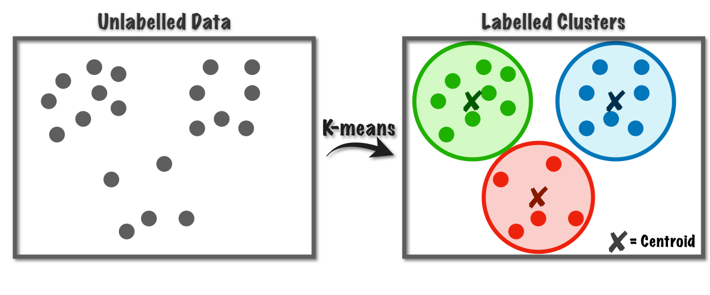

# Unsupervised Learning and Recommendations

## Project Overview

This project is a training notebook on unsupervised machine learning and recommendation-style data exploration. It demonstrates how to discover structure in unlabeled data using clustering and visualization techniques with Python and scikit-learn.

The notebook uses the Iris dataset and explores:

- clustering algorithms: `KMeans`, `DBSCAN`, and hierarchical clustering,
- dimensionality reduction: `PCA` and `t-SNE`,
- feature scaling with `MinMaxScaler`,
- cluster quality evaluation with purity, NMI, ARI, and silhouette score.

## Notebook Contents

The notebook covers the following sections:

1. **Introduction to Unsupervised Learning**
   - Explains unsupervised learning and why it matters.
   - Places clustering and dimensionality reduction within the ML workflow.
2. **Iris Dataset Exploration**
   - Loads the Iris dataset from `seaborn`.
   - Visualizes the data using scatter plots.
3. **Data Preprocessing**
   - Scales numerical features using `MinMaxScaler`.
4. **KMeans Clustering**
   - Fits `KMeans` with 3 clusters.
   - Examines cluster centers and predictions.
   - Uses inertia and the elbow plot to choose the number of clusters.
5. **Cluster Evaluation**
   - Computes purity score, normalized mutual information (NMI), adjusted Rand index (ARI), and silhouette score.
6. **DBSCAN Clustering**
   - Demonstrates density-based clustering and noise detection.
7. **Hierarchical Clustering**
   - Introduces hierarchical clustering concepts and provides an exercise for implementation.
8. **Dimensionality Reduction**
   - Applies `PCA` to reduce Iris to 2 dimensions.
   - Uses `t-SNE` to visualize non-linear structure.

## Data and Tools

- Dataset: Iris flower dataset (`sepal_length`, `sepal_width`, `petal_length`, `petal_width`, and species labels).
- Libraries:
  - `numpy`
  - `pandas`
  - `seaborn`
  - `matplotlib`
  - `scikit-learn`
  - `jupyter`

## How to Run

Open the notebook in Jupyter and run the cells sequentially:

```bash
jupyter notebook "Unsupervised_Learning&Recommendations.ipynb"
```

## Installation

This folder contains a `requirements.txt` file that references the shared dependency file in the repository root. From the repository root, install required packages with:

```bash
pip install -r requirements.txt
```

If running the notebook independently, install the main packages directly:

```bash
pip install numpy pandas scikit-learn matplotlib seaborn jupyter
```

## Repository Structure

```
Unsupervised Learning and Recommendations/
├── README.md
├── requirements.txt
├── Unsupervised_Learning&Recommendations.ipynb
└── images/
    ├── hierarchy.gif
    ├── intro.png
    └── kmeans_flow.png
```

## Included Images

The following images are included in the `images/` folder for documentation and visual explanation:

- 
- 
- 

## Key Takeaways

- `KMeans` is useful for partitioning data into a fixed number of clusters.
- `DBSCAN` identifies clusters based on density and can detect outliers.
- `PCA` reduces dimensionality by projecting data onto principal components.
- `t-SNE` visualizes high-dimensional structure in 2D, especially for non-linear patterns.
- In unsupervised learning, model evaluation often relies on cluster quality metrics and visual inspection.

## Author

Omar Hafez Khalil
