# Weather Forecasting System using Machine Learning

## Overview

This project predicts whether it will rain **tomorrow** in Australia using historical weather observations. It is structured as a hands-on machine learning training exercise that walks through the full classification workflow: exploratory data analysis, preprocessing, model training, hyperparameter tuning, evaluation, and deployment-ready model export.

Two Jupyter notebooks implement the same prediction task with two different algorithms:

- **Decision Tree** — interpretable baseline with tree visualization and pruning
- **Random Forest** — ensemble model with systematic hyperparameter search and a saved inference pipeline

Both notebooks use the same dataset, the same time-based train/validation/test split, and comparable preprocessing steps, which makes it easy to compare how each algorithm behaves on real-world weather data.

## Project Objectives

This project demonstrates practical ML skills on a realistic tabular dataset:

- Working with **missing values** and **mixed data types** (numeric + categorical)
- Building a reproducible preprocessing pipeline (imputation, scaling, encoding)
- Using a **time-based split** instead of a random split to avoid data leakage
- Training and comparing **Decision Tree** and **Random Forest** classifiers
- Detecting and reducing **overfitting** through hyperparameter tuning
- Evaluating models with **accuracy** and **confusion matrices**
- Exporting a trained model with `joblib` for future predictions

## Dataset

| Property            | Value                                                                                                              |
| ------------------- | ------------------------------------------------------------------------------------------------------------------ |
| **File**            | `weatherAUS.csv`                                                                                                   |
| **Source**          | [Kaggle — Weather Dataset (Rattle Package)](https://www.kaggle.com/datasets/jsphyg/weather-dataset-rattle-package) |
| **Records**         | 145,460 daily observations                                                                                         |
| **Locations**       | 49 Australian weather stations                                                                                     |
| **Date range**      | 2007-11-01 to 2017-06-25                                                                                           |
| **Target variable** | `RainTomorrow` (Yes / No)                                                                                          |

### Features

| Category            | Columns                                                                                    |
| ------------------- | ------------------------------------------------------------------------------------------ |
| **Metadata**        | `Date`, `Location`                                                                         |
| **Temperature**     | `MinTemp`, `MaxTemp`, `Temp9am`, `Temp3pm`                                                 |
| **Rain & moisture** | `Rainfall`, `RainToday`, `Humidity9am`, `Humidity3pm`                                      |
| **Wind**            | `WindGustDir`, `WindGustSpeed`, `WindDir9am`, `WindDir3pm`, `WindSpeed9am`, `WindSpeed3pm` |
| **Atmospheric**     | `Pressure9am`, `Pressure3pm`, `Cloud9am`, `Cloud3pm`, `Evaporation`, `Sunshine`            |
| **Target**          | `RainTomorrow`                                                                             |

### Class Distribution

After removing rows with a missing target, the dataset is **imbalanced**: roughly **77% No rain** and **23% Yes rain**. This matters when interpreting accuracy and confusion matrices.

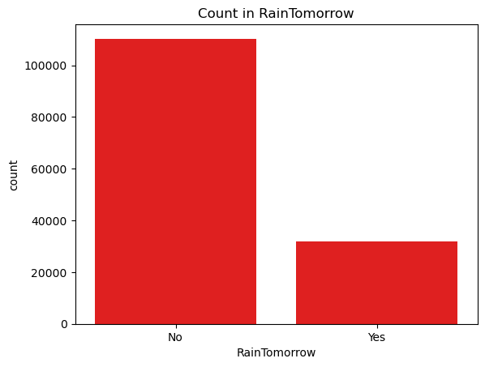

### Data Quality Notes

- **3,267 rows** have a missing `RainTomorrow` label and are dropped during preprocessing.
- Missing values are common in columns such as `Sunshine`, `Evaporation`, `Cloud3pm`, and `Cloud9am`.
- Wind direction columns also contain missing categorical values, which are filled with `"Unknown"`.

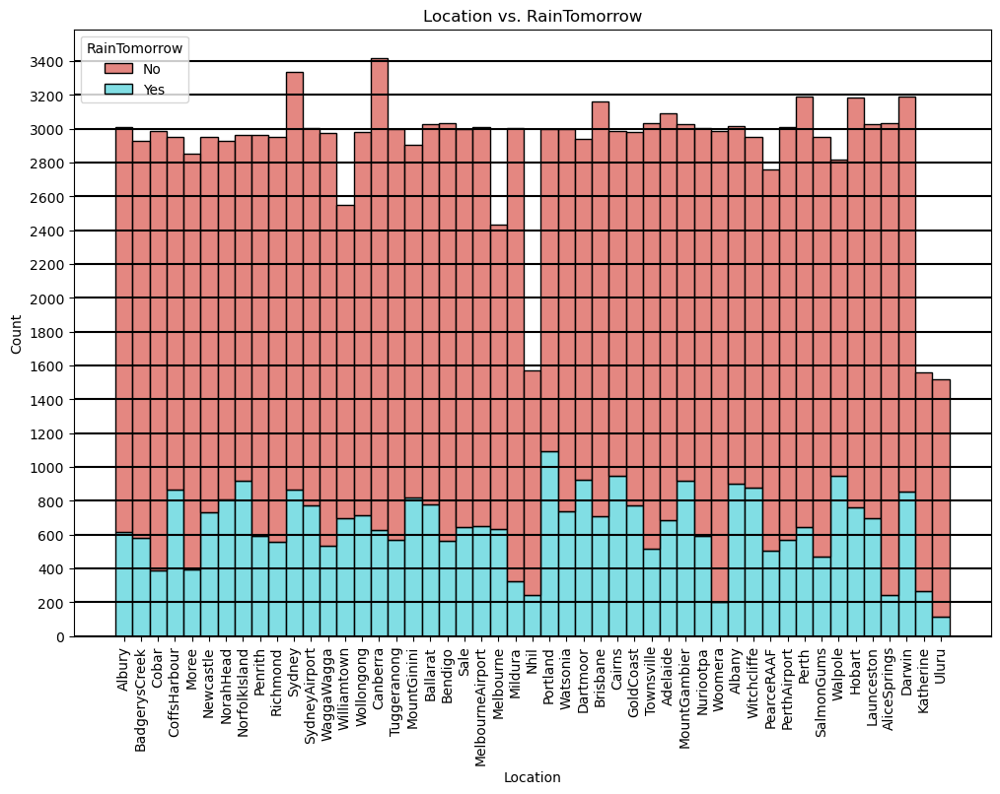

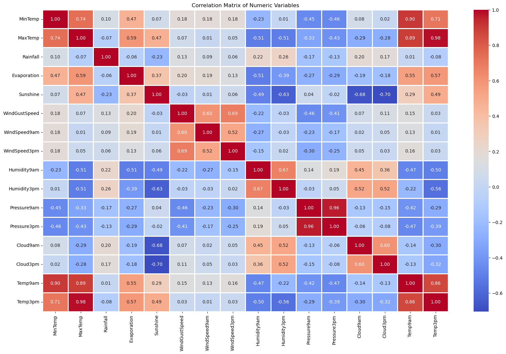

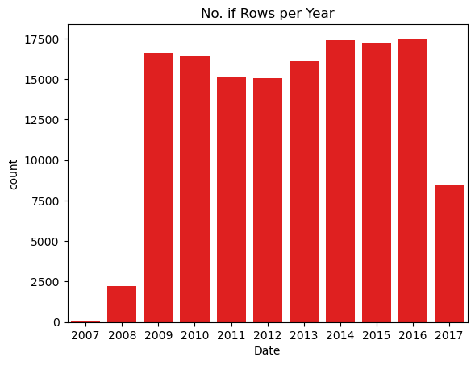

## Project Structure

```
Weather Forecasting System using Machine Learning/
├── Decision Tree.ipynb          # Decision tree workflow, tuning, and visualization
├── Random Forest.ipynb            # Random forest workflow, tuning, and model export
├── weatherAUS.csv                 # Local copy of the dataset
├── requirements.txt               # Python dependencies
├── images/                        # Exported plots from the notebooks
│   ├── dt_target_distribution.png
│   ├── dt_rainfall_by_target.png
│   ├── dt_correlation_heatmap.png
│   ├── dt_rows_per_year.png
│   ├── dt_validation_confusion_matrix.png
│   ├── dt_feature_importance.png
│   ├── dt_max_depth_tuning.png
│   ├── rf_validation_confusion_matrix.png
│   ├── rf_feature_importance.png
│   ├── rf_n_estimators_tuning.png
│   ├── rf_max_depth_tuning.png
│   └── rf_final_feature_importance.png
└── README.md
```

## Machine Learning Pipeline

Both notebooks follow the same high-level workflow:

```
Load data → EDA → Drop missing targets → Time-based split
    → Impute numeric features → Scale numeric features
    → Encode categorical features → Train model
    → Evaluate → Tune hyperparameters → Final evaluation
```

### 1. Data Loading

The notebooks can load data in two ways:

- From the local file `weatherAUS.csv` included in this folder
- By downloading the Kaggle dataset with `opendatasets`

### 2. Train / Validation / Test Split

Instead of a random split, the project uses **year-based splitting** to better simulate forecasting on future data:

| Split          | Years       | Purpose                                   |
| -------------- | ----------- | ----------------------------------------- |
| **Train**      | Before 2015 | Model training                            |
| **Validation** | 2015        | Hyperparameter tuning and model selection |
| **Test**       | After 2015  | Final out-of-time evaluation              |

### 3. Preprocessing

| Step                       | Decision Tree Notebook                   | Random Forest Notebook                   |
| -------------------------- | ---------------------------------------- | ---------------------------------------- |
| Missing numeric values     | `SimpleImputer(strategy='mean')`         | `SimpleImputer(strategy='mean')`         |
| Numeric scaling            | `MaxAbsScaler`                           | `RobustScaler`                           |
| Missing categorical values | Fill with `"Unknown"`                    | Fill with `"Unknown"`                    |
| Categorical encoding       | `OneHotEncoder(handle_unknown='ignore')` | `OneHotEncoder(handle_unknown='ignore')` |

Important design choice: the imputer and scaler are **fit on training data only**, then applied to validation and test sets. This prevents information leakage from future observations into the training pipeline.

### 4. Model Training

#### Decision Tree (`Decision Tree.ipynb`)

- Starts with a default `DecisionTreeClassifier(random_state=42)`
- Shows clear overfitting: **100% training accuracy** vs **~79% validation accuracy**
- Applies hyperparameter tuning for:
  - `max_depth`
  - `max_leaf_nodes`
- Visualizes trees and feature importance
- Explores tree pruning to reduce overfitting

Best tuned configuration in the notebook:

```python
DecisionTreeClassifier(max_depth=7, max_leaf_nodes=128, random_state=42)
```

#### Random Forest (`Random Forest.ipynb`)

- Starts with a default `RandomForestClassifier(n_jobs=-1, random_state=42)`
- Uses an ensemble of decision trees to improve generalization
- Performs extensive hyperparameter tuning across:
  - `n_estimators`
  - `max_depth`
  - `max_leaf_nodes`
  - `max_features`
  - `min_samples_split` / `min_samples_leaf`
  - `min_impurity_decrease`
  - `bootstrap` / `max_samples`
  - `class_weight`
- Saves the final pipeline to `aussie_rain_randomForest.joblib`

Final tuned configuration in the notebook:

```python
RandomForestClassifier(
    random_state=42,
    n_jobs=-1,
    class_weight={'No': 1, 'Yes': 1.5},
    max_features=20,
    max_depth=30,
    n_estimators=500,
    min_samples_split=5,
    min_samples_leaf=2,
)
```

## Results

### Model Comparison

| Model                                               | Training Accuracy | Validation Accuracy | Test Accuracy |
| --------------------------------------------------- | ----------------- | ------------------- | ------------- |
| Decision Tree (default)                             | 100.00%           | 79.25%              | —             |
| Decision Tree (`max_depth=3`)                       | 82.91%            | 83.34%              | —             |
| Decision Tree (`max_depth=7`)                       | 84.67%            | 84.54%              | —             |
| Decision Tree (`max_depth=7`, `max_leaf_nodes=128`) | 84.67%            | 84.54%              | 83.11%        |
| Random Forest (default)                             | 100.00%           | **85.68%**          | —             |
| Random Forest (tuned)                               | 97.96%            | **85.78%**          | **84.58%**    |

### Key Takeaways

- The **default decision tree overfits heavily**, which is visible in the large gap between training and validation performance.
- **Hyperparameter tuning** significantly improves generalization for both models.
- **Random Forest** achieves the best validation and test performance in this project.
- Because the dataset is imbalanced, accuracy alone is not enough; the **confusion matrix** helps reveal how well each model predicts the minority class (`RainTomorrow = Yes`).

### Decision Tree Evaluation

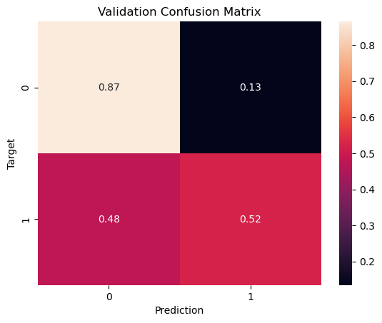

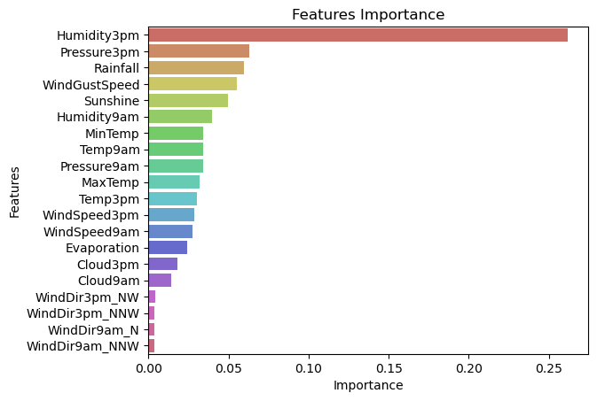

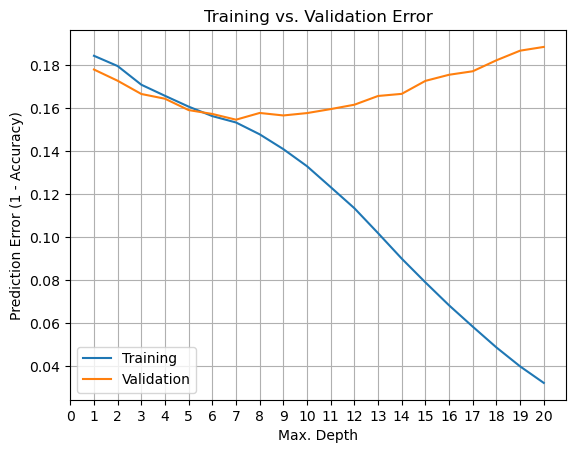

### Random Forest Evaluation

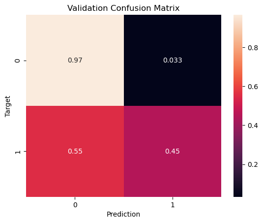

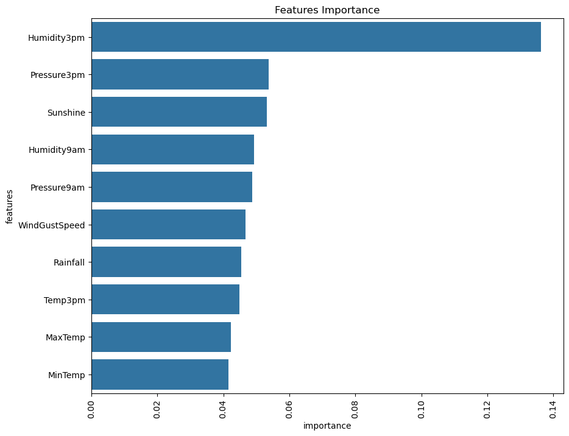

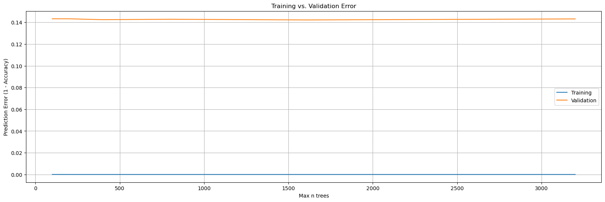

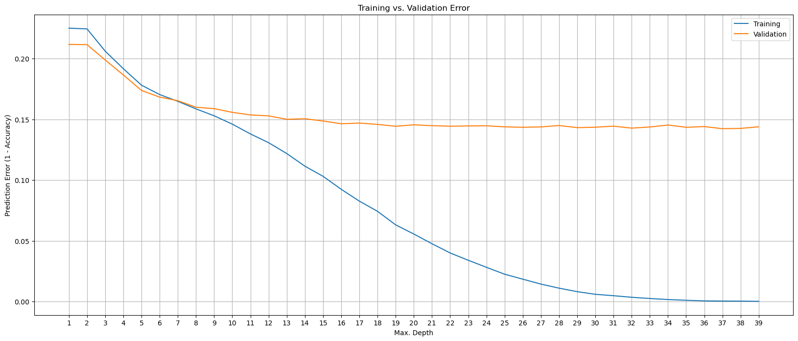

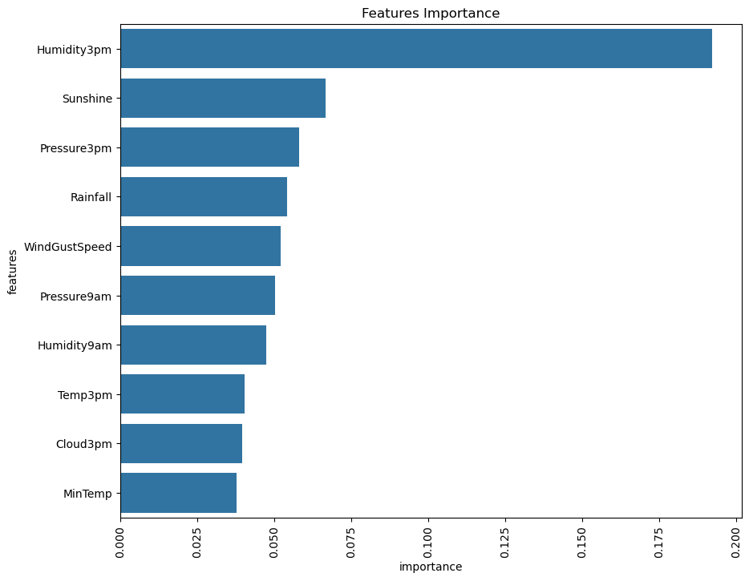

## Technologies Used

- **Python 3.9+**
- **pandas** — data loading and manipulation
- **NumPy** — numerical operations
- **scikit-learn** — preprocessing, models, and metrics
- **Matplotlib / Seaborn** — visualization
- **opendatasets** — optional Kaggle dataset download
- **joblib** — model persistence (Random Forest notebook)

## Requirements / Installation

Install dependencies from this project folder:

```bash
pip install -r requirements.txt
```

## Usage

1. Make sure `weatherAUS.csv` is present in this directory, or run the Kaggle download cell in either notebook.
2. Open one of the notebooks in Jupyter:

```bash
jupyter notebook "Decision Tree.ipynb"
```

or

```bash
jupyter notebook "Random Forest.ipynb"
```

3. Run the cells from top to bottom.
4. After running `Random Forest.ipynb`, you can load the saved model:

```python
import joblib

bundle = joblib.load("aussie_rain_randomForest.joblib")
model = bundle["model"]
predict_input = bundle["predict_input"]
```

The saved bundle also includes the fitted imputer, scaler, encoder, and helper functions for making predictions on new weather records.

## Limitations

- This is a **binary classification** exercise, not a full meteorological forecasting system.
- Predictions depend on observed same-day weather features rather than long-range atmospheric modeling.
- Class imbalance means models may favor predicting **No rain** unless metrics such as recall and F1 are examined carefully.
- Performance is tied to the historical Australian dataset and may not transfer directly to other regions or time periods.

## Dataset Credit

Dataset: **Weather Dataset (Rattle Package)**  
Source: [Kaggle — jsphyg/weather-dataset-rattle-package](https://www.kaggle.com/datasets/jsphyg/weather-dataset-rattle-package)

## Author

- **Developed by:** Omar Hafez Khalil
- **GitHub:** [OmarHKhalil](https://github.com/OmarHKhalil)
- **LinkedIn:** [Omar Khalil](https://www.linkedin.com/in/omar-khalil-55a674281)

## License

This project is intended for educational and portfolio use as part of a machine learning training collection.
